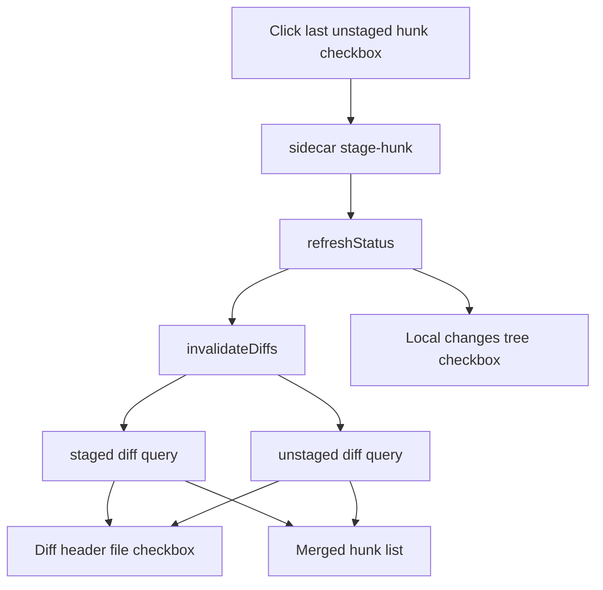

# Last Hunk Stage Flicker Investigation

## Problem Statement

When staging the last remaining hunk in a file, multiple checkboxes update at visibly different times:

| UI element | Observed effect |
| --- | --- |
| Local changes tree file checkbox | Updates as status changes |
| Diff header file checkbox | Updates from staged/unstaged diff query state |
| Per-hunk checkbox | Moves from unstaged to staged state |

The result looks like a "wave". There is also a brief glitch where a hunk appears for a millisecond.

## Current Status

Implemented and verified.

## Timeline

| Time | Action | Result |
| --- | --- | --- |
| 2026-06-11 | Searched renderer and sidecar for hunk staging paths | Found `DiffPanel`, `StatusPanel/FileRow`, and `stores/git.tsx` as relevant renderer files |
| 2026-06-11 | Inspected diff rendering | `DiffPanel` renders staged and unstaged diff queries as one merged list |
| 2026-06-11 | Inspected hunk mutation | Hunk staging calls sidecar, then `refreshStatus(path)`, then `invalidateDiffs(path)` |
| 2026-06-11 | Inspected status rendering | Tree checkbox is driven by `git.state.status`; diff header checkbox is driven by `stagedHunks()` and `unstagedHunks()` |

## Files Inspected

| File | Why it matters |
| --- | --- |
| `src/renderer/components/DiffPanel/index.tsx` | Renders file-level diff checkbox and per-hunk checkboxes |
| `src/renderer/stores/git.tsx` | Owns `stageHunk`, `unstageHunk`, status refresh, and diff invalidation ordering |
| `src/renderer/components/StatusPanel/FileRow.tsx` | Renders local changes tree file checkbox |
| `src/renderer/components/StatusPanel/index.tsx` | Passes staging callbacks into the local changes list |
| `src/renderer/lib/status-file-rows.ts` | Derives `unstaged`, `partial`, and `staged` file states from Git status |
| `src/renderer/components/ui/checkbox.tsx` | Shared checkbox implementation |
| `src/renderer/components/__tests__/DiffPanel.test.tsx` | Existing renderer tests for hunk and file checkbox behavior |
| `src/renderer/stores/__tests__/git.test.tsx` | Existing store tests around hunk staging/status races |

## Evidence

### Diff Query Rendering

`DiffPanel` creates two independent queries for the selected file:

```ts
const unstagedQuery = makeDiffQuery(false)
const stagedQuery = makeDiffQuery(true)
```

It then merges both query results into a single list:

```ts
const mergedHunks = createMemo<HunkEntry[]>(() => {
  const staged = stagedHunks()
  const unstaged = unstagedHunks()
  const entries: HunkEntry[] = [
    ...staged.map((hunk) => ({ staged: true, ... })),
    ...unstaged.map((hunk) => ({ staged: false, ... }))
  ]
  return entries.sort((left, right) => left.indexStart - right.indexStart)
})
```

The file-level diff checkbox is derived from those same two independent query results:

```ts
const fileStageState = () => {
  if (stagedHunks().length === 0) {
    return 'unstaged'
  }
  return unstagedHunks().length > 0 ? 'partial' : 'staged'
}
```

### Hunk Mutation Ordering

`stageHunk` and `unstageHunk` share `applyHunkMutation`:

```ts
const response = await sidecarFetch(op, { repoPath: path, file, hunkHeader }, StageHunkResponseSchema)
if (response._tag === 'GitError') {
  setState('error', response.message)
}
await refreshStatus(path)
invalidateDiffs(path)
return response._tag === 'Ok'
```

This means the local changes tree can update before the diff panel has refreshed its staged/unstaged hunk queries.

### Checkbox State Sources



## Confirmed Findings

1. The tree checkbox and diff checkboxes are not driven by one atomic state update.
2. Hunk staging refreshes status before invalidating diff queries, so the local changes tree can settle first.
3. The staged and unstaged diff results refresh independently.
4. During the refresh, `mergedHunks()` can briefly combine a fresh staged diff with a stale unstaged diff, or the reverse.
5. That mixed-generation render explains a transient duplicate/extra hunk: the just-staged hunk may appear in the fresh staged query while still present in the stale unstaged query.

## Hypotheses

| Hypothesis | Status | Notes |
| --- | --- | --- |
| Checkbox component itself is glitching | Unlikely | It is a simple controlled input with `indeterminate` set by effect |
| Sidecar returns incorrect diff | Not indicated | Integration tests cover staging hunks and final staged state |
| Renderer combines old/new query data | Likely | `mergedHunks()` consumes two independently refreshed query caches |
| Status refresh ordering causes visible wave | Likely | Status refresh happens before diff invalidation |

## Proposed Minimal Fix

The lowest-risk fix is in the renderer, not the sidecar:

1. Make hunk staging expose a pending hunk operation state for the selected file/header/op.
2. While a hunk operation is pending, have `DiffPanel` render an optimistic merged hunk view for that hunk.
3. For `stageHunk`, remove the pending hunk from the unstaged list immediately and show it as staged.
4. For `unstageHunk`, remove the pending hunk from the staged list immediately and show it as unstaged.
5. Disable the clicked hunk checkbox while the mutation is pending to prevent double submits.
6. Clear the pending state only after both `refreshStatus(path)` and diff invalidation/refetch have completed.

This keeps the visible checkboxes in one local transition and prevents `mergedHunks()` from displaying the same hunk from two query generations.

## Alternative Fixes Considered

| Option | Pros | Cons |
| --- | --- | --- |
| Await `invalidateQueries` before `refreshStatus` | Very small change | Does not prevent staged/unstaged diff queries from updating independently |
| Clear diff query cache before invalidation | Avoids mixed old/new hunks | Replaces the glitch with a blank/no-changes flash |
| Combine staged and unstaged diff into one sidecar endpoint | Atomic data source | Larger API change and more tests |
| Refetch both diffs manually in `DiffPanel` and swap them together | Atomic diff render | More local state and more code than optimistic pending state |

## Test Plan

| Layer | Test |
| --- | --- |
| Renderer unit | Add/update `DiffPanel.test.tsx` to simulate staging the last unstaged hunk while staged and unstaged diff queries resolve at different times; assert no duplicate hunk is rendered during pending/refetch |
| Renderer unit | Assert hunk checkbox reflects the pending staged state immediately |
| Renderer unit | Assert hunk checkbox is disabled while the hunk mutation is pending if the implementation chooses to disable it |

Command to run after implementation:

```sh
pnpm test:renderer -- src/renderer/components/__tests__/DiffPanel.test.tsx src/renderer/stores/__tests__/git.test.tsx
```

## Open Questions

1. Should the pending optimistic state be stored in `useGitStore` so both `StatusPanel` and `DiffPanel` can observe it, or kept local to `DiffPanel` for the smallest surface area?
2. Should the local changes tree checkbox also be optimistic for the last hunk, or is eliminating the diff duplicate and hunk wave sufficient?

## Recommended Next Action

Implement the pending hunk rendering in `DiffPanel` with the smallest API addition needed in `GitStore`, then add the renderer regression test for mixed staged/unstaged query generations.

## Verification So Far

Initial investigation completed before implementation. Final verification is listed below.

## Implementation Summary

| File | Change |
| --- | --- |
| `src/renderer/stores/git.tsx` | Added optional hunk-stage hints so staging the final hunk can optimistically update status before the sidecar returns; made diff invalidation awaitable for hunk mutations |
| `src/renderer/components/DiffPanel/index.tsx` | Added local pending hunk rendering that removes the stale source-side hunk, shows the target-side hunk once, and disables the affected checkbox until status and diff refetch complete |
| `src/renderer/components/ui/checkbox.tsx` | Added `disabled` support for pending hunk checkboxes |
| `src/renderer/components/__tests__/DiffPanel.test.tsx` | Added a regression test where staged and unstaged diff refetches resolve separately; asserts the last staged hunk never appears twice |
| `src/renderer/stores/__tests__/git.test.tsx` | Added a store test for optimistic status when staging the final hunk |

## Final Verification

| Command | Result | Notes |
| --- | --- | --- |
| `pnpm test:renderer -- src/renderer/components/__tests__/DiffPanel.test.tsx src/renderer/stores/__tests__/git.test.tsx` | Passed | Vitest ran the renderer suite: 28 files, 240 tests passed; existing React `act(...)` warnings remain |
| `pnpm exec biome check src/renderer/components/DiffPanel/index.tsx src/renderer/components/__tests__/DiffPanel.test.tsx src/renderer/components/ui/checkbox.tsx src/renderer/stores/git.tsx src/renderer/stores/__tests__/git.test.tsx .agent-investigations/2026-06-11-last-hunk-stage-flicker.md` | Passed | Biome checked touched source/test files; Markdown is not included by this Biome invocation |
| `pnpm typecheck` | Passed | `tsc --noEmit` and `tsc -p tsconfig.node.json --noEmit` passed |
| `pnpm check` | Blocked | Fails before checking source because unrelated nested Biome root configs exist under `.claude/worktrees/*/biome.json` |

## Remaining Risks

1. The pending hunk identity uses the operation header for the source hunk and content hash for target-side matching. If a file has multiple identical hunks, the UI could suppress a matching target hunk more broadly during the short pending window.
2. Existing test output includes React `act(...)` warnings unrelated to this change.

## Recommended Next Action

Manually verify the local changes view with a file containing two hunks, then stage the final hunk and confirm the tree, file header, and hunk checkbox transition together without a duplicate/extra hunk flash.
