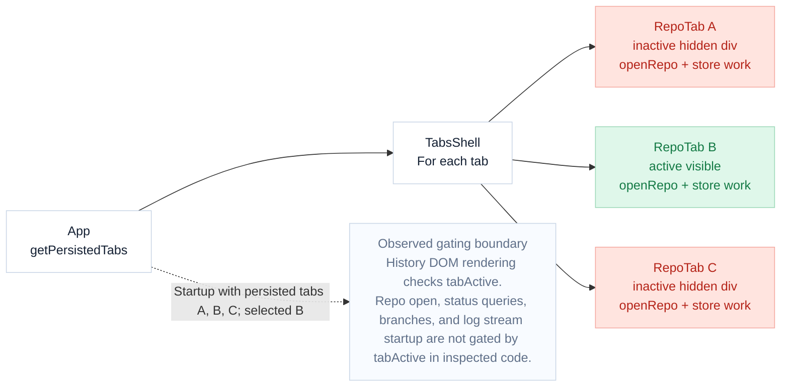
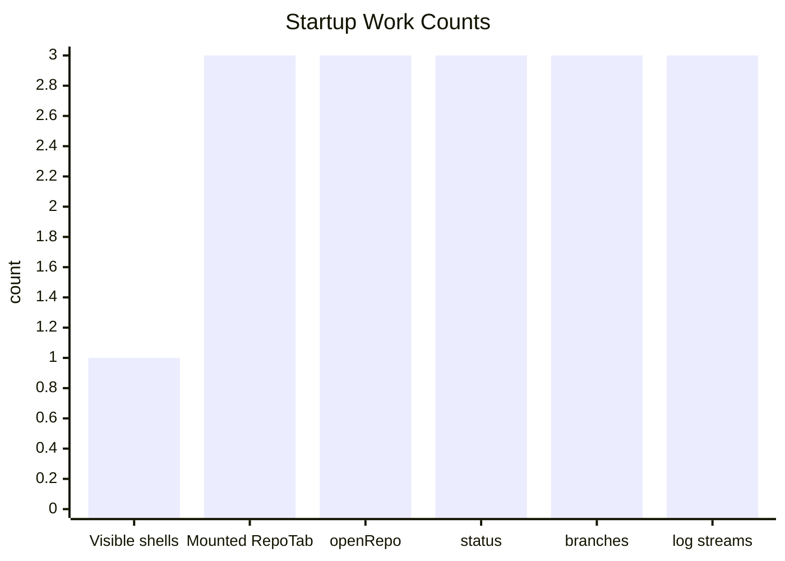
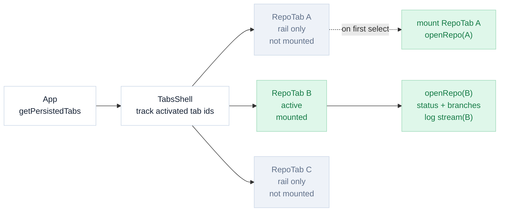
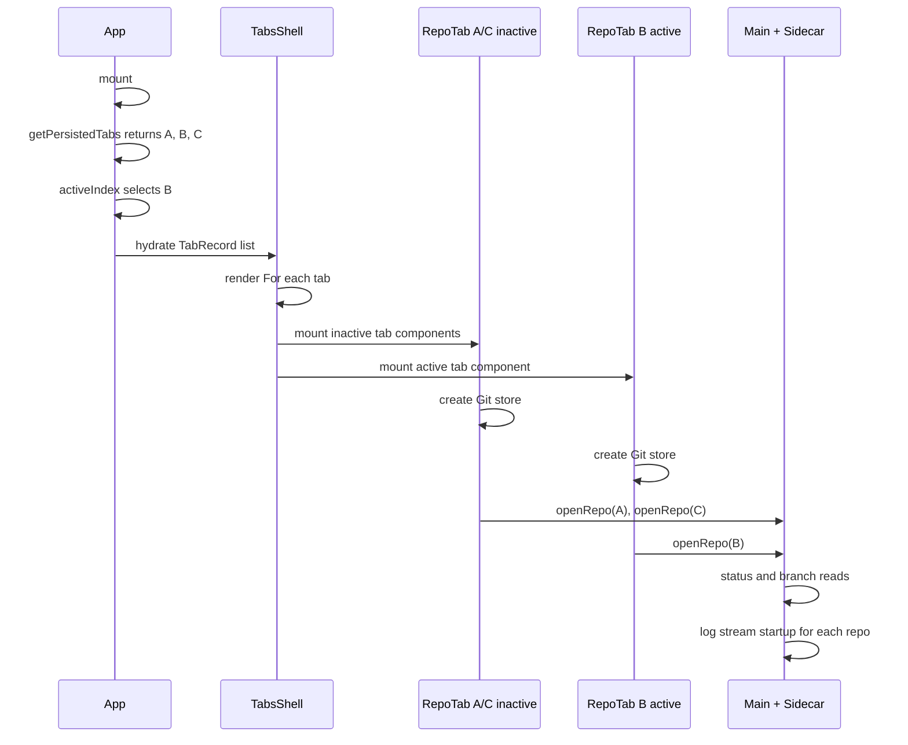
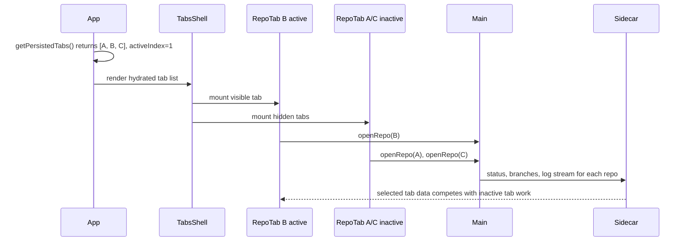

# Restored Tabs Performance Investigation

**Status:** fix implemented  
**Date:** 2026-06-11  
**Area:** renderer tab restore  
**Implementation:** lazy activation at restored tab boundary

Rebase correctly restores multiple tabs from the previous session. The primary performance fault was confirmed: CSS-hidden inactive tabs were mounted and opened repos plus log streams while the selected tab was trying to become interactive. The implemented fix keeps inactive restored repo tabs unloaded until first selection.

## Diagnostic Result

A temporary renderer diagnostic test confirmed the startup fan-out. The production fix is now implemented and covered by an App-level renderer test.

| Metric | Value |
| --- | ---: |
| Ranked hypotheses | 4 |
| Product/test files changed | 6 |
| Diagnostic test passed | 1 |

## Pre-Fix Mount Graph



Legend:

| Color | Meaning |
| --- | --- |
| Green | Selected tab work |
| Red | Inactive tab work competing at startup |

## Pre-Fix Startup Work Fan-Out

This graph shows the confirmed `openRepo` and `startLogStream` fan-out for three restored repo tabs under the inspected current path. Status and branch counts are code-path evidence from the same mount path, not profiler timings.



Markdown fallback:

| Work item | Count | Relative load |
| --- | ---: | --- |
| Visible tab shells | 1 | ###....... |
| Mounted `RepoTab` | 3 | ########## |
| `openRepo` calls | 3 | ########## |
| Status queries | 3 | ########## |
| Branch queries | 3 | ########## |
| Log streams | 3 | ########## |

The diagnostic test passed by observing `openRepo` and `startLogStream` calls for inactive restored paths during initial render.

## Large Repo Impact Analysis

A 6 GB repository would not be loaded entirely into memory just because an inactive restored tab mounts, but it can still materially slow startup because the inactive tab begins Git-backed work immediately.

The impact depends more on repository shape than raw byte size:

| Driver | Why it matters |
| --- | --- |
| Working tree file count | `git status` can walk many paths, especially with cold filesystem cache. |
| Untracked file count | Untracked scans are often the worst case in large app repos. |
| `.git` object and pack size | Log/history operations can touch large packfiles and commit graphs. |
| Ref count | Branch and remote-ref queries become more expensive with many refs. |
| Disk cache state | Cold cache after reboot or app launch is much slower than warm cache. |
| Concurrent restored tabs | Multiple inactive repos compete with the active tab for disk, CPU, sidecar work, and IPC/query scheduling. |

Expected user-visible effect:

| Scenario | Likely impact |
| --- | --- |
| Warm cache, clean repo, few untracked files | Noticeable but possibly small startup delay. |
| Cold cache, large working tree, many ignored/untracked paths | Seconds to tens of seconds of degraded responsiveness are plausible. |
| Multiple restored large repos | Active tab data can be delayed by background `openRepo`, status, branch, and log stream work. |

The current bug is therefore not that 6 GB is necessarily read at boot. The bug is that an inactive 6 GB repo is allowed to start the same expensive Git startup path as the selected tab, so it can contend with the selected tab before the user asks to view it.

## Candidate Solutions

### Recommended minimal fix: lazy activation at the tab boundary

Render the selected restored tab normally at startup, but render inactive restored repo tabs as lightweight placeholders until first selection.

Expected behavior:

| Moment | Expected work |
| --- | --- |
| App starts with restored tabs A, B, C and active B | Only B mounts `RepoTab`; only B calls `openRepo`; only B starts status, branch, and log work. |
| User selects A later | A mounts `RepoTab` for the first time and starts its Git work then. |
| User switches back to B | B should remain usable without reopening if it stayed mounted after first activation. |

This should be implemented above `RepoTab`, likely in `TabsShell` or `TabView`, by tracking which tab ids have been activated. Inactive unactivated repo tabs keep their persisted metadata for the rail and session restore, but do not create `useGitStore` and do not call `openRepo`.

The rail should visually distinguish unloaded restored tabs. The current `RepoRail` already renders compact repo avatar buttons from `TabDescriptor`, so the least disruptive UX is to add a descriptor state such as `loaded` or `activationState` and render unloaded repo buttons with a muted/gray treatment.

Suggested unloaded rail state:

| Element | Treatment |
| --- | --- |
| Avatar color | Desaturate or replace with muted gray background. |
| Button opacity | Slightly lower opacity, for example around 60-70%, but keep text readable. |
| Hover | Normal hover affordance so it still feels clickable. |
| Tooltip/title | Include unloaded state, for example `repo-name - not loaded yet`. |
| Active unloaded tab | Should immediately transition to normal loading/opening state when selected. |

Avoid making unloaded tabs look disabled. They are actionable; they are just not loaded yet.

Why this is the best first fix:

| Property | Result |
| --- | --- |
| Smallest behavioral change | New tabs and the selected restored tab keep current behavior. |
| Directly fixes confirmed fan-out | Hidden restored tabs no longer start `openRepo` or log streams at launch. |
| Preserves tab restore UX | Restored inactive tabs still appear in the rail immediately. |
| Avoids broad store rewrites | The Git store can keep its current assumptions for a mounted repo. |

Test seam:

```text
persisted tabs: [A, B, C]
activeIndex: 1

at boot:
  openRepo called with B only
  startLogStream called with B only

after selecting A:
  openRepo called with A
  startLogStream called with A
```

### Stronger follow-up: active-gate store background refresh

After the minimal fix, previously activated tabs may still remain mounted while inactive. If we want stronger isolation, gate sidecar-backed work inside `useGitStore` with `tabActive()` as well.

Candidate gates:

| Work | Current risk | Possible gate |
| --- | --- | --- |
| Status query | Enabled by repo path only. | `enabled: Boolean(path) && tabActive()` |
| Local branch query | Enabled by repo path only. | `enabled: Boolean(path) && tabActive()` |
| Remote refs query | Enabled by repo path plus local branch readiness. | Include `tabActive()` in `enabled`. |
| Repo change watcher refresh | Refreshes matching inactive repo. | Ignore or defer while inactive, then refresh on activation. |
| Log stream startup | Starts in `openRepo`. | Start only when active, or cancel/defer when inactive. |

This is more invasive because it changes behavior for already-open tabs, not just restored inactive tabs. It needs careful activation refresh behavior so switching to a previously inactive tab shows current status promptly.

### Not recommended as first fix: sidecar queue only

Adding priority/queueing in the sidecar could reduce contention, but it would not fix the renderer doing unnecessary work. It also leaves inactive tabs opening repos and starting streams without user intent. It is better as a later hardening layer if profiling still shows contention after lazy activation.

## Implemented Outcome

The lazy activation fix was implemented in `TabsShell`.



Changed files:

| File | Change |
| --- | --- |
| `src/renderer/App.tsx` | Tracks activated tab ids and only mounts `TabView` for active or previously activated tabs. |
| `src/renderer/components/shell/RepoRail.tsx` | Renders unloaded repo tabs with muted styling and `not loaded yet` accessible labels/tooltips. |
| `src/renderer/hooks/useTabs.ts` | Adds optional `loaded` metadata to `TabDescriptor`. |
| `src/renderer/__tests__/App.test.tsx` | Adds coverage for deferring inactive restored repo `openRepo` and `startLogStream` work until selection. |

## EMFILE Follow-Up

The later `EMFILE: too many open files` report points to file descriptor exhaustion in the main process. The stack showed failures in unrelated operations:

| Failed operation | Meaning |
| --- | --- |
| `get-sidebar-prefs` reading `config.json` | Electron Store could not open the config file because the process had exhausted FDs. |
| `sidecar-request` loopback `connect EMFILE` | Node could not open a socket to the sidecar for the same reason. |

The most likely FD source is `src/main/repoWatcher.ts`: every successful repo open started a recursive chokidar watch over the entire working tree. For a large 6 GB project with many files, that can consume a very large number of file descriptors even if only one tab is active.

Mitigation implemented:

| File | Change |
| --- | --- |
| `src/main/repoWatcher.ts` | Added `WORKING_TREE_WATCH_DEPTH = 0` and passed it to the working-tree chokidar watcher, preventing recursive full-tree watcher fan-out. |
| `src/main/__tests__/repoWatcher.test.ts` | Added a main-process unit test locking the shallow watcher depth. |

Tradeoff: nested working-tree edits may no longer auto-trigger status refresh through the watcher. Git operations and explicit app interactions still refresh state, and this is safer than exhausting process file descriptors on large repos. If we need better live refresh later, prefer an adaptive strategy over recursive chokidar, for example focus-triggered status refresh, explicit refresh, or a bounded low-frequency active-tab status refresh.

Verified post-fix behavior:

```text
persisted tabs: [repo-a, repo-b, repo-c]
activeIndex: 1

at boot:
  openRepo(repo-b)
  startLogStream(repo-b)

not at boot:
  openRepo(repo-a)
  openRepo(repo-c)
  startLogStream(repo-a)
  startLogStream(repo-c)

after selecting repo-a:
  openRepo(repo-a)
  startLogStream(repo-a)
```

## Pre-Fix Startup Sequence



## Hypothesis Matrix

| Rank | Hypothesis | Prediction | Status |
| ---: | --- | --- | --- |
| 1 | Inactive restored `RepoTab`s eagerly call `openRepo`. | Initial render with tabs A, B, C selected B calls `openRepo` for all three paths. | test-confirmed |
| 2 | Inactive tabs run TanStack queries because `enabled` checks only path. | Status and branch mocks receive calls for inactive paths after their stores get repo paths. | code-confirmed |
| 3 | Inactive tabs start log streams despite hidden history UI. | `startLogStream` is called for inactive restored paths. | test-confirmed |
| 4 | Hidden workspaces still execute branch and timeline memo work. | After cached branch data arrives, inactive `Workspace` logic still computes sidebar inputs. | secondary |

## Evidence Cards

| File | Evidence |
| --- | --- |
| `src/renderer/App.tsx` | Every tab is rendered in a `For`. Inactive tabs receive an invisible absolute wrapper, so their child components remain mounted. |
| `src/renderer/RepoTab.tsx` | `useGitStore` is created immediately, and an effect calls `git.openRepo(props.repoPath)` when the path differs from the last request. |
| `src/renderer/stores/git.tsx` | Status, local branch, and remote ref queries are enabled by repo path. Log stream restart runs during `openRepo`. |
| `src/renderer/WorkspaceViews.tsx` | `HistoryView` checks `tabActive` before rendering the panel, which protects the DOM but not the earlier Git startup work. |

## Mermaid Sequence Source

This is the compact source from the original HTML document, kept for comparison with the expanded sequence above.



## Investigation Timeline

| Step | Finding |
| --- | --- |
| 1 | Searched renderer tab restore, active-tab, and sidecar query paths. |
| 2 | Inspected `App`, `TabView`, `RepoTab`, `Workspace`, `WorkspaceViews`, and `useGitStore`. |
| 3 | Confirmed inactive tabs are hidden with CSS but remain mounted. |
| 4 | Confirmed implementation is paused until this file is approved. |
| 5 | Ran a temporary renderer diagnostic test. It confirmed `openRepo` and `startLogStream` are called for inactive restored repos at boot. |
| 6 | Implemented lazy activation in `TabsShell` and muted unloaded restored tabs in the rail. |
| 7 | Added an App-level renderer test for the post-fix boot/select behavior. |
| 8 | User reported `EMFILE: too many open files` from `get-sidebar-prefs` and sidecar loopback `connect EMFILE`; investigation reopened to check for request/mount storms or FD leaks. |
| 9 | Identified recursive working-tree chokidar watch as the likely FD exhaustion source for large repos and capped watcher depth. |

## Files, Commands, and Resume Notes

| Category | Details |
| --- | --- |
| Files inspected | `src/renderer/App.tsx`, `src/renderer/TabView.tsx`, `src/renderer/RepoTab.tsx`, `src/renderer/Workspace.tsx`, `src/renderer/WorkspaceViews.tsx`, `src/renderer/stores/git.tsx`, `src/renderer/__tests__/App.test.tsx`, `src/test/setup.ts`, `src/test/render-app.tsx` |
| Commands and tools run | Used repository file search and content search for tab restore, active tab, query, and log stream paths. Read the relevant renderer and test files. Ran `pnpm vitest run --config vitest.config.ts "src/renderer/__tests__/restored-tabs-hypothesis.test.tsx"`, which passed and confirmed the original eager inactive-tab behavior. After implementation, ran `pnpm vitest run --config vitest.config.ts src/renderer/__tests__/App.test.tsx`, `pnpm exec biome check src/renderer/App.tsx src/renderer/components/shell/RepoRail.tsx src/renderer/hooks/useTabs.ts src/renderer/__tests__/App.test.tsx .agent-investigations/2026-06-11-restored-tabs-performance.md AGENTS.md`, `pnpm typecheck`, `pnpm test:renderer`, `pnpm vitest run --config vitest.main.config.ts src/main/__tests__/repoWatcher.test.ts`, and `pnpm test:main`. |
| Changed files so far | `AGENTS.md` was updated to require Markdown investigation files. This Markdown investigation file was added and updated. Product/test implementation changed `src/renderer/App.tsx`, `src/renderer/components/shell/RepoRail.tsx`, `src/renderer/hooks/useTabs.ts`, `src/renderer/__tests__/App.test.tsx`, `src/main/repoWatcher.ts`, and `src/main/__tests__/repoWatcher.test.ts`. The original HTML investigation file remains unchanged. |
| Markdown conversion | This Markdown file was added as a comparison artifact. The original HTML file remains unchanged. |
| Final outcome | Inactive restored repo tabs now stay unloaded until first selection. They remain visible in the rail with muted styling and a `not loaded yet` label. |
| Remaining risk | Already-activated tabs still remain mounted while inactive. If profiling shows continued background contention, the next step is active-gating store refresh/query work. The shallow watcher avoids FD exhaustion but may reduce automatic nested-file change detection. |
