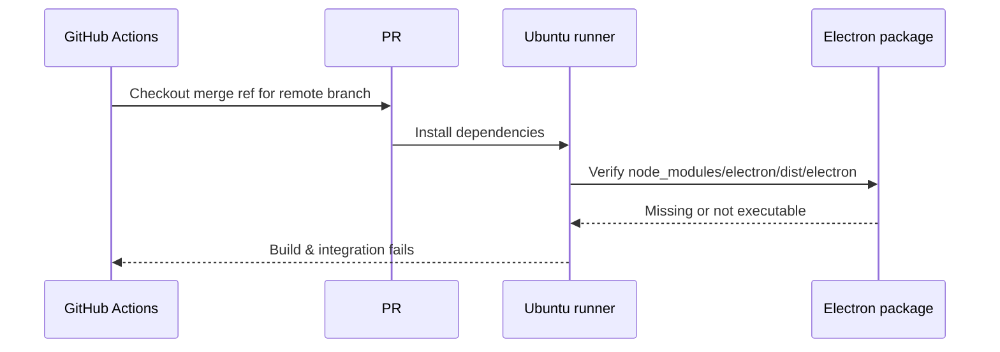
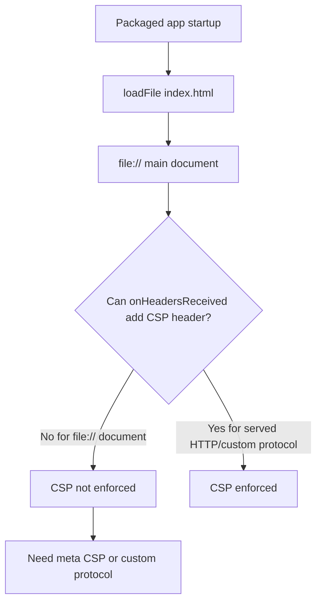

# PR 33 CI and Review Loop

## Problem Statement

User asked to check PR `#33` in a loop and fix failing pipelines and review comments until done.

## Current State

| Item | Status |
| --- | --- |
| Repository | `ionalexandru99/rebase-git` |
| Branch | `phase-0-guardrails` |
| PR | `#33` Phase 0 guardrails |
| Base | `main` |
| Local branch | Ahead of `origin/phase-0-guardrails` by 1 commit |
| Remote checks | `1/11` failing before push |
| Failing check | `Build & integration` before push |
| Review state | CodeRabbit prior comments addressed; Codex CSP concern fixed locally |

## Timeline

| Time | Action | Evidence |
| --- | --- | --- |
| 2026-06-16 | Checked local branch and PR status | `git status --short --branch`, `gh pr status` |
| 2026-06-16 | Listed PR checks and reviews | `gh pr checks 33`, `gh pr view 33 --json ...` |
| 2026-06-16 | Fetched inline PR comments | `gh api repos/ionalexandru99/rebase-git/pulls/33/comments` |
| 2026-06-16 | Fetched failing job log | `gh run view 27644842088 --job 81753966273 --log` |
| 2026-06-16 | Inspected local unpushed commit summary | `git show --stat --oneline --decorate HEAD` |
| 2026-06-16 | Inspected local workflow patch | `git show --stat --patch --find-renames HEAD -- .github/workflows/ci.yml` |
| 2026-06-16 | Inspected CSP and renderer entry files | `.github/workflows/ci.yml`, `src/main/index.ts`, `src/renderer/index.html`, `package.json` |
| 2026-06-16 | User flagged concern with manual zip fix | Reassessed Electron install strategy |
| 2026-06-16 | Implemented local fixes | Official Electron rebuild/verify path and packaged CSP meta injection |
| 2026-06-16 | Ran local verification | Main/renderer tests, typecheck, check, build, E2E, smoke |

## Evidence Gathered

### PR Checks

```text
Build & integration: fail
Type check & lint: pass
Unit tests: pass
CodeQL: pass
Analyze jobs: pass
Socket/Snyk checks: pass
CodeRabbit: pass
```

### Failing CI Job

The failing `Build & integration` job stops at the Electron binary verification step:

```text
Run test -x node_modules/electron/dist/electron
Process completed with exit code 1.
```

The job is running against the PR merge ref built from remote commit `f6b18973...`.

### Local Unpushed Commit

Local `HEAD` is ahead by one commit:

```text
386591b ci: install Electron binary deterministically via curl+unzip
.github/workflows/ci.yml | 20 +++++++++++++++-----
```

This targeted the failing Electron binary verification, but it had not been pushed yet.

After user feedback that the zip approach may be wrong, this session replaced the manual `curl`/`unzip` implementation with Electron's official package installer path:

```yaml
- name: Rebuild Electron binary
  run: pnpm rebuild electron

- name: Verify Electron binary
  run: node -e "const fs = require('node:fs'); const electron = require('electron'); fs.accessSync(electron, fs.constants.X_OK); console.log(electron)"
```

The `Build & integration` job also disables setup-node's automatic package-manager cache so this job does not restore cached package side effects before the Electron rebuild/verify step.

### Review Comments

CodeRabbit comments were marked addressed by follow-up replies and review-thread responses.

Codex still has an unresolved `P2` comment on `src/main/index.ts`:

```text
Enforce packaged CSP without relying on file:// headers
```

Claim: packaged builds use `win.loadFile(...)`; `onHeadersReceived` cannot deliver CSP headers to the main `file://` document; Electron docs recommend a page-level meta tag or custom protocol. Current `index.html` explicitly omits the meta tag, so packaged builds may still run without the intended strict CSP.

Confirmed current code:

```ts
function applyContentSecurityPolicy(): void {
  const policy = buildContentSecurityPolicy()
  session.defaultSession.webRequest.onHeadersReceived((details, callback) => {
    callback({
      responseHeaders: {
        ...details.responseHeaders,
        'Content-Security-Policy': [policy]
      }
    })
  })
}

if (process.env.ELECTRON_RENDERER_URL) {
  win.loadURL(`${process.env.ELECTRON_RENDERER_URL}/index.html`)
} else {
  win.loadFile(path.join(__dirname, '../renderer/index.html'))
}
```

`src/renderer/index.html` says CSP is intentionally omitted as a meta tag because dev and packaged currently share the same source HTML:

```html
<!-- CSP is enforced via the onHeadersReceived response header in src/main/index.ts
     (dev-relaxed for Vite HMR, strict when packaged). A static meta tag here would be
     applied identically in dev and would break HMR, so it is intentionally omitted. -->
```

Local fix: extract CSP helpers to `src/main/csp.ts`, keep header CSP for dev/server responses, and inject a strict packaged-only meta tag through a Vite `transformIndexHtml` build plugin. The source `index.html` remains meta-free for dev HMR; `out/renderer/index.html` now contains:

```html
<meta http-equiv="Content-Security-Policy" content="default-src 'none'; script-src 'self'; style-src 'self' 'unsafe-inline'; img-src 'self' data:; font-src 'self'; connect-src 'self';" />
```

## Architecture Sketch





## Hypotheses

| Hypothesis | Status | Notes |
| --- | --- | --- |
| Manual zip commit fixes failed Electron binary check | Discarded | Replaced with `pnpm rebuild electron` plus package-reported executable verification. |
| Codex CSP concern is valid | Confirmed | Current packaged path uses `loadFile(...)`; current strict policy is only attached as a response header. |
| CodeRabbit comments still require changes | Discarded for now | Inline threads show addressed replies and CodeRabbit acknowledgements. |

## Files Inspected

| File | Reason |
| --- | --- |
| `.github/workflows/ci.yml` | Failing CI and local unpushed fix target. |
| `src/main/index.ts` | CSP construction and application. |
| `src/main/csp.ts` | Pure CSP helpers and packaged meta injection. |
| `electron.vite.config.ts` | Packaged renderer HTML transform. |
| `src/renderer/index.html` | Renderer document and CSP/meta behavior. |
| `src/main/__tests__/csp.test.ts` | Unit coverage for CSP policy and meta injection. |

## Commands Run

```bash
git status --short --branch
git log --oneline -10
gh pr status
gh pr checks 33
gh pr view 33 --json number,title,url,headRefName,baseRefName,mergeable,reviewDecision,statusCheckRollup,comments,reviews
gh api repos/ionalexandru99/rebase-git/pulls/33/comments --jq '.[] | {id,path,line,side,author:.user.login,body,commit_id,created_at,updated_at}'
gh run view 27644842088 --job 81753966273 --log
git show --stat --oneline --decorate HEAD
pnpm check:fix
pnpm test:main
pnpm typecheck
pnpm check
pnpm build
pnpm rebuild electron
node -e "const fs = require('node:fs'); const electron = require('electron'); fs.accessSync(electron, fs.constants.X_OK); console.log(electron)"
pnpm test:renderer
pnpm test:e2e
pnpm test:smoke
```

## Current Status

Local fixes are implemented and verified. Changes are not pushed yet.

## Verification Results

| Command | Result | Notes |
| --- | --- | --- |
| `pnpm check:fix` | Passed | Fixed formatting in 2 files. |
| `pnpm test:main` | Passed | 25 files, 159 tests. |
| `pnpm typecheck` | Passed | Renderer and node TS configs. |
| `pnpm check` | Passed | Biome no fixes needed. |
| `pnpm build` | Passed | Generated packaged CSP meta in `out/renderer/index.html`. |
| `pnpm rebuild electron` | Passed | Official Electron postinstall path. |
| Electron executable verification | Passed | `require('electron')` path is executable locally. |
| `pnpm test:renderer` | Passed | 31 files, 271 tests; existing React `act(...)` warnings only. |
| `pnpm test:e2e` | Passed | 5 tests. |
| `pnpm test:smoke` | Passed | App launched, timed out by design after 10s, no fatal output. |

## Recommended Fix

Implemented the smallest change that preserves dev HMR and packaged strict CSP:

1. Keep `onHeadersReceived` CSP for dev server responses.
2. Inject a packaged-only strict meta CSP into built renderer HTML using Vite's `transformIndexHtml`.
3. Avoid a custom protocol because it would touch more of the navigation and asset-loading surface.
4. Avoid the manual Electron zip path; use `pnpm rebuild electron` and verify `require('electron')` instead.

## Next Steps

1. Commit the local fixes.
2. Push the branch.
3. Re-check PR checks/comments until resolved or blocked by external service latency.
