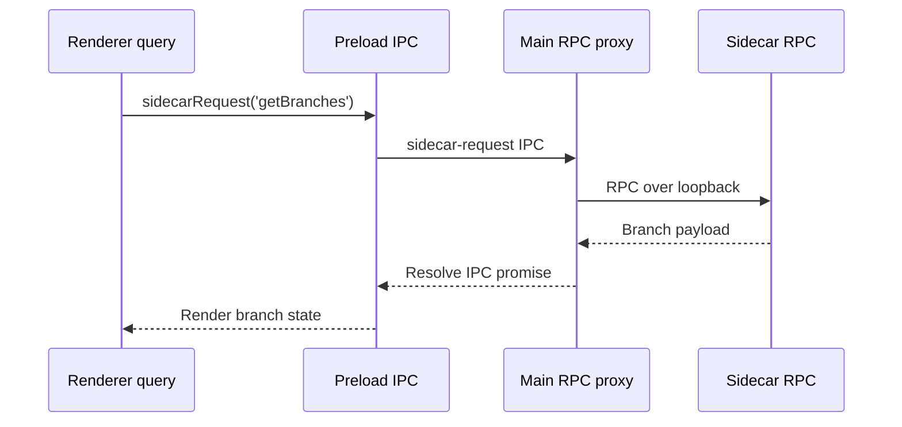

# E2E RPC Contract Drift Investigation

## Problem Statement

`pnpm test:e2e` currently fails before issue `#66` work begins. The goal is to diagnose the failing e2e test, identify the public interface contract it should assert, and fix that first in a separate commit before implementing issue `#66`.

## Context

| Source | Relevant facts |
| --- | --- |
| `CONTEXT.md` | Rebase is an Electron + React Git GUI. The renderer reaches a forked sidecar over IPC; the sidecar owns Git work. A Repo Session is the live state of one open repository in the sidecar. |
| `package.json` | `pnpm test:e2e` runs `playwright test`. |
| `playwright.config.ts` | E2E specs live in `e2e/`; the suite launches generated output from `out/`. |
| Prior investigation `.agent-investigations/2026-06-24-issue-65-e2e-failures.md` | A previous stale-build failure had the same symptom, but at that time checked-in source still accepted legacy read op names. |

## Initial Repo State

- Worktree status before this investigation: clean (`git status --short` produced no output).
- Relevant e2e spec: `e2e/app-launches.spec.ts`.
- Relevant public sidecar IPC seam: `window.electronAPI.sidecarRequest(op, body)`.

## Feedback Loop

Broad loop:

```bash
pnpm test:e2e
```

Observed failure:

```text
1) [chromium] › e2e/app-launches.spec.ts:78:3 › Git GUI E2E › renderer reaches the sidecar through the preload proxy for status + branches

Error: page.evaluate: Error: Error invoking remote method 'sidecar-request': Error: invalid sidecar request
```

Tight loop:

```bash
pnpm exec playwright test e2e/app-launches.spec.ts --grep "renderer reaches"
```

Red-capable assessment:

| Criterion | Status | Evidence |
| --- | --- | --- |
| Red-capable | Yes | It exercises `window.electronAPI.sidecarRequest` through preload, Electron IPC, main validation, and sidecar dispatch. |
| Deterministic | Yes | The narrowed loop fails consistently at the same IPC request. |
| Fast | Yes | The narrowed loop completes in a few seconds. |
| Agent-runnable | Yes | It runs unattended from the workspace. |

## Timeline

| Time | Action | Result |
| --- | --- | --- |
| 2026-06-25 | Read `CONTEXT.md`, `package.json`, `playwright.config.ts`, and the prior e2e investigation. | Confirmed this is the sidecar IPC/RPC seam. |
| 2026-06-25 | Ran `pnpm test:e2e`. | Failed on `sidecarRequest('get-status', { repoPath })` with `invalid sidecar request`. |
| 2026-06-25 | Ran `pnpm exec playwright test e2e/app-launches.spec.ts --grep "renderer reaches"`. | Same failure, reduced to one test. |
| 2026-06-25 | Compared `src/main/ipc/settings.ts` and `out/main/index.js`. | Both reject non-RPC op names via `isRpcOp(op)`. This is not only a stale generated output problem. |
| 2026-06-25 | Inspected `src/shared/rpc.ts`. | Read operations now exist as RPC tags: `getStatus`, `getBranches`, `getLocalBranches`, `getRemoteRefs`, `getLog`, `getDiff`, `stashList`. |
| 2026-06-25 | Searched renderer code for legacy read op names. | No renderer calls to `get-status`, `get-branches`, or `sidecarFetch` remain. Only the e2e spec still uses legacy read op names. |
| 2026-06-25 | Updated the e2e spec to call `getStatus` and `getBranches`. | The narrowed RPC seam test passed. |
| 2026-06-25 | Ran the restored-repo e2e. | Failed because the restored tab rendered `Timeline 0 commits` and no current branch button. |
| 2026-06-25 | Instrumented concurrent restored-boot RPC reads across main and sidecar. | Sidecar handlers completed, but some main-process Effect RPC calls did not resolve back to Electron IPC. |
| 2026-06-25 | Changed main RPC execution to create and dispose a runtime per `runRpcTag` call. | Restored-repo e2e passed consistently after rebuilding. |
| 2026-06-25 | Removed temporary diagnostics and rebuilt `out/`. | Generated e2e target matches cleaned source. |
| 2026-06-25 | Ran narrowed e2e, full e2e, and static checks. | All passed. |

## Evidence

Failing e2e call:

```ts
await api.sidecarRequest('get-status', { repoPath })
await api.sidecarRequest('get-branches', { repoPath })
```

Current main-process IPC validation:

```ts
if (typeof op !== 'string' || !isRpcOp(op)) {
  throw new Error('invalid sidecar request')
}
return sidecarRpcCall(op, body)
```

Current shared RPC declarations:

```ts
export const GetStatus = Rpc.make('getStatus', ...)
export const GetBranches = Rpc.make('getBranches', ...)
```

Current renderer search result:

```text
No renderer matches for sidecarFetch, get-status, get-branches, get-log, get-diff, or stash-list.
```

## Hypotheses

| Rank | Hypothesis | Prediction | Status |
| --- | --- | --- | --- |
| 1 | The e2e test is stale after reads migrated to RPC tags. | Changing the e2e calls to `getStatus` and `getBranches` will make the narrowed test pass without app code changes. | Most likely. |
| 2 | Main IPC validation is too strict and should still accept legacy kebab-case read names. | Restoring legacy acceptance would make the test pass, but would conflict with the current single RPC seam and issue `#65` cleanup direction. | Unlikely because renderer no longer uses legacy names. |
| 3 | The generated `out/` app is stale. | Running `pnpm build` alone would make the e2e pass. | Discarded for this repo state because checked-in source and `out/` both currently reject legacy names. |
| 4 | Restored boot has a concurrent main-process RPC runtime race. | Sidecar logs will show handlers completing while renderer queries wait or render empty data. | Confirmed. Per-call runtime fixes the restored-repo e2e. |

## Interface Decision Needed

The current codebase exposes sidecar operations through one RPC-tag interface over `window.electronAPI.sidecarRequest(op, body)`. The e2e test should assert the public RPC contract by using `getStatus` and `getBranches`, not the deleted legacy `get-status` and `get-branches` names.

The restored-repo failure was a separate runtime issue on the same seam: concurrent renderer reads on startup crossed Electron IPC and reached the sidecar, but a shared main-process Effect RPC runtime could leave some call promises waiting after the sidecar had already responded. The main process now creates a runtime for each RPC call and disposes it afterward.



## Proposed TDD Slice

Behavior to test:

| Slice | Public interface | Expected behavior |
| --- | --- | --- |
| E2E tracer bullet | `window.electronAPI.sidecarRequest('getStatus', { repoPath })` and `sidecarRequest('getBranches', { repoPath })` | A renderer can read status and branches through preload → main IPC → sidecar RPC, and the sidecar config remains hidden from the renderer. |

Implementation plan after approval:

1. Update the existing e2e spec to call `getStatus` and `getBranches`.
2. Run the narrowed loop and confirm it passes.
3. Run `pnpm test:e2e`.
4. Run the minimal relevant static check if needed after formatting.
5. Commit only the e2e/test-contract fix.

## Changed Files

| File | Change | Reason |
| --- | --- | --- |
| `e2e/app-launches.spec.ts` | Replaced legacy read op names with `getStatus` and `getBranches`; kept restored app relaunch behavior. | Assert the current public RPC contract through preload and main IPC. |
| `src/main/sidecar-rpc.ts` | Create and dispose the Effect RPC runtime per call. | Avoid unresolved concurrent restored-boot reads after sidecar responses. |
| `src/main/sidecar.ts` | Removed cached runtime cleanup call/import. | The runtime is no longer process-wide cached state. |

## Verification

| Command | Result |
| --- | --- |
| `pnpm build` | Passed. |
| `pnpm exec playwright test e2e/app-launches.spec.ts --grep "restored repo"` | Passed. |
| `pnpm exec playwright test e2e/app-launches.spec.ts --grep "renderer reaches"` | Passed. |
| `pnpm test:e2e` | Passed, 8 tests. |
| `pnpm typecheck` | Passed. |
| `pnpm check` | Passed. |

## Current Status

Implemented and verified. The remaining action is to inspect the final diff and commit the e2e/runtime fix separately before starting issue `#66`.

## Open Questions

- No open questions for this slice.
- Issue `#66` should remain untouched until after this fix is committed.
