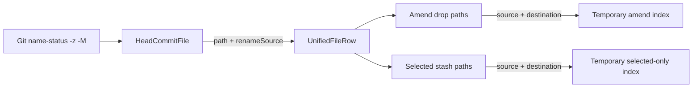

# Final Rename Semantics

## Problem

Dropping a rename from the HEAD commit during Amend restored only the destination path. Because the
destination did not exist in the parent commit, the amended tree lost both paths instead of restoring
the source. Selected staged stashes also sent only the destination path, so Git could not remove and
later restore the complete rename.

Paths must remain literal, and rename identity must come from structured `renameSource` data rather
than display text.

## Repository State

The worktree already contained extensive unrelated changes before this investigation. The changes
for this fix were limited to the amend/status/stash paths and their tests. Existing unrelated changes
were not reverted or modified intentionally.

## Flow

## Evidence

| Area | Before | Confirmed result |
| --- | --- | --- |
| HEAD status | Rename source discarded; rename detection lacked `-M` | `R*` entries carry `renameSource` |
| Amend drop | Destination alone restored from parent | Source and destination are restored as one rename identity |
| Selected stash | Destination alone reached `stashPush` | Both structured paths reach the sidecar |
| Git stash | Direct source path was rejected because it was absent from index/worktree | Selected patch is stashed through a temporary index |
| Literal safety | Paths could contain Git pathspec metacharacters | Tests use spaces, brackets, and `*` literally |

## Timeline

1. Inspected `amend.ts`, status row conversion, amend payload assembly, and selected stash flow.
2. Added a real-Git Amend regression deriving drop paths from the HEAD payload. It failed with an
   amended tree missing the source path.
3. Enabled rename detection and retained `renameSource`; the Amend regression passed.
4. Added renderer payload tests. They failed because both Amend and stash payloads contained only the
   destination.
5. Added structured source propagation and source/destination payload expansion; renderer tests
   passed.
6. Added a real-Git selected staged stash regression. Git rejected the absent rename source path.
7. Discarded a broad include/exclude pathspec approach because Git cleanup touched excluded staged
   paths and failed around partial staging.
8. Isolated selected staged changes in a temporary index seeded from `HEAD`, allowing native staged
   stash behavior without affecting unrelated staged or unstaged layers.
9. Ran focused tests, complete relevant suites, typecheck, and Biome.

## Files Inspected

- `src/sidecar/amend.ts`
- `src/sidecar/amend-index.ts`
- `src/sidecar/stash.ts`
- `src/shared/schemas/git.ts`
- `src/renderer/WorkspaceViews.tsx`
- `src/renderer/lib/amend-drops.ts`
- `src/renderer/lib/status-file-rows.ts`
- Relevant sidecar, shared, and renderer tests

## Changed Behavior

| File group | Change |
| --- | --- |
| Shared schema | Added optional structured `renameSource` to HEAD commit files |
| Sidecar Amend | Enabled rename detection and retained source identity |
| Renderer rows/payloads | Carried `renameSource`; expanded whole rename drops and selected stash paths |
| Sidecar stash | Built selected staged stashes in a temporary index, then reset only selected real-index paths |
| Tests | Added real-Git Amend/stash regressions and renderer/shared payload coverage |

## Verification

| Command | Result |
| --- | --- |
| Focused Amend integration file | 31 passed |
| Focused stash/discard integration file | 22 passed |
| Focused renderer tests | 25 passed |
| Focused shared RPC tests | 15 passed |
| `pnpm test:renderer` | 603 passed |
| `pnpm test:main` | 152 passed |
| `pnpm test:sidecar` | 319 passed |
| `pnpm typecheck` | Passed |
| `pnpm check` | Passed, no fixes |
| `git diff --check` | Passed |

## Final Status

Implemented and verified. No commit was created. No known rename-semantics gap remains in the
requested Amend or selected staged stash flows.
