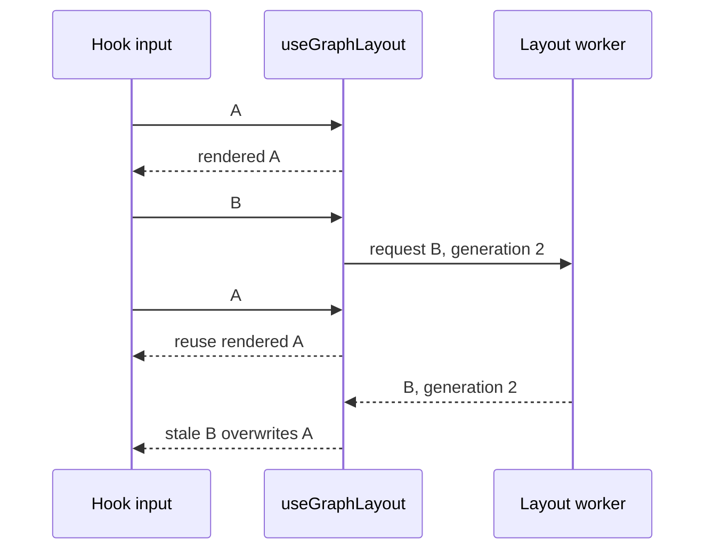
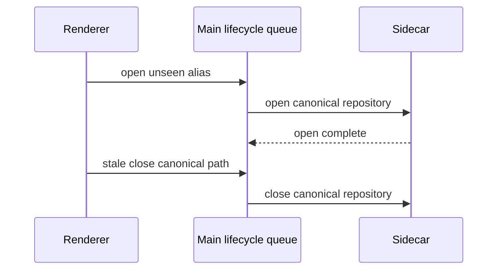
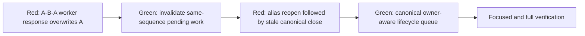
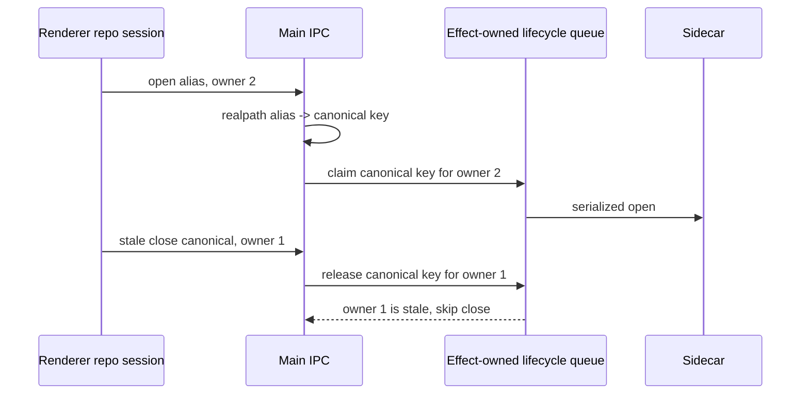

# Final Renderer And Main Race Fixes

## Problem Statement

Fix two concrete races with strict red-green TDD while preserving per-repository isolation:

1. A graph layout for commit sequence A is rendered, worker layout B starts, the input reverts to A,
   and the eventual B response must not overwrite A.
2. A repository is closed and immediately reopened through a first-seen filesystem alias. A stale
   canonical close must not run after the alias reopen and tear down the new repository session.

The sidecar RPC transport is out of scope. No commit will be created.

## Scope

| Area | Production seam | Test seam |
|---|---|---|
| Graph layout generation | `src/renderer/hooks/useGraphLayout.ts` | `src/renderer/hooks/__tests__/useGraphLayout.test.ts` |
| Renderer repository session | `src/renderer/stores/repo-session.tsx` | Existing provider tests as needed |
| Main repository lifecycle | `src/main/repo-lifecycle-queue.ts`, `src/main/ipc/repo.ts` | `src/main/__tests__/repo-lifecycle-queue.test.ts` |

## Confirmed Findings

### 1. Same-Sequence Reuse Leaves A Worker Generation Live

`runLayout` only increments `layoutGeneration` after the same-sequence early return. In the failing
sequence, A is the current rendered layout, B is pending in a worker, and reverting to A enters that
early return because A matches the rendered layout. The hook clears `layoutPending`, but it neither
increments the generation nor clears `pendingWorkerLayout`.



The requested minimal behavior is to invalidate the worker generation and pending request before
returning the already-rendered same sequence.

### 2. Canonical Queueing Serializes The Wrong Order

Main currently computes `tabResourceKey(event.sender.id, normalizeRepoPath(repoPath))` before both
open and close queue operations. For an existing symlink, `normalizeRepoPath` uses native realpath,
so a first-seen alias and canonical path already receive the same queue key without renderer cache
knowledge.

That identity guarantee is necessary but not sufficient. The immediate sequence can be:



Because the stale close can be enqueued after the reopen, ordinary FIFO serialization makes the
race deterministic in the wrong direction. Renderer-only alias caching cannot solve a first-seen
alias, because its identity is unknown until open completes.

The lifecycle seam needs an atomic owner/version decision associated with the canonical per-tab repo
key. An open claims a new owner before its queued task starts. A close captures the owner it intends
to release and becomes a no-op if a newer open has already claimed that key. Keys remain independent,
so one repository cannot block another.

## Regression Seams

| Test | Exact observable behavior |
|---|---|
| Hook A -> B -> A worker race | After A is rendered, B is posted, A is supplied again, and B responds, the hook still exposes A and is not pending |
| Real path / symlink lifecycle race | An alias reopen claims the same canonical key as the real path; a stale close for the prior owner does not run, while unrelated repo tasks proceed |

These are public seams. The hook test observes the hook result. The main test exercises
`RepoLifecycleQueue` rather than mocking `ipcMain` or Electron objects.

## Strict TDD Sequence



Each regression will be added and run failing before its corresponding production change. Only the
smallest implementation needed for that vertical slice will then be applied.

## Ranked Hypotheses

| Rank | Hypothesis | Prediction |
|---|---|---|
| 1 | The graph same-sequence early return fails to invalidate pending worker generation | Incrementing generation and clearing pending state in that branch prevents B from replacing A |
| 2 | Canonical key equality exists, but FIFO queueing lacks owner supersession | A real/symlink test shares one key yet still runs a stale close after reopen |
| 3 | Renderer alias caching is the only missing identity mechanism | A first-seen alias would remain unsafe even though main realpath already maps it to the canonical queue key, so this hypothesis should be discarded |
| 4 | Global queue contention causes the repository race | An unrelated-key task already starts independently, so the race should reproduce without global blocking |

## Files Inspected

- `CONTEXT.md`
- `src/renderer/hooks/useGraphLayout.ts`
- `src/renderer/hooks/__tests__/useGraphLayout.test.ts`
- `src/renderer/stores/repo-session.tsx`
- `src/renderer/stores/__tests__/git.test.tsx`
- `src/main/repo-lifecycle-queue.ts`
- `src/main/__tests__/repo-lifecycle-queue.test.ts`
- `src/main/ipc/repo.ts`
- `src/shared/repo-path.ts`
- `src/shared/__tests__/repo-path.test.ts`
- `src/preload/index.ts`
- `src/renderer/lib/rpc-client.ts`

## Evidence Gathered

| Evidence | Meaning |
|---|---|
| Same-sequence return is before `++layoutGeneration.current` | Reverting to rendered A does not reject pending B |
| Same-sequence return only clears React `layoutPending` | `pendingWorkerLayout.current` remains B |
| Worker handler accepts any response matching current generation | B remains acceptable after A reuse |
| `normalizeRepoPath` calls `fs.realpathSync.native` | Existing aliases can be canonicalized before queueing in main |
| Queue is keyed by web contents plus canonical repository path | Cross-tab/repo isolation is preserved, but there is no owner generation |
| Queue executes every same-key task in FIFO order | A stale close after reopen is not suppressed |
| Existing renderer alias test covers only a previously learned alias | It does not cover the first-seen real-path-to-alias transition |

## Worktree Assumptions

The worktree contains extensive existing changes, including changes and untracked files in the exact
owned paths. Those changes are treated as user or other-agent work. The fix will build on current
contents and will not revert unrelated work.

## Verification Plan

1. Run each new focused regression and capture its red failure.
2. Run each focused regression after its minimal production fix.
3. Run focused renderer hook/store and main lifecycle suites.
4. Run full renderer tests.
5. Run full main tests.
6. Run project typecheck.
7. Run Biome check, applying `check:fix` only to owned files if needed.
8. Run `git diff --check` and inspect the final owned-file diff.

## Current Status

Implementation and verification are complete. Both confirmed races have deterministic regression
coverage. No commit was created.

## Implementation

| File | Outcome |
|---|---|
| `src/renderer/hooks/useGraphLayout.ts` | Same-sequence reuse now advances the layout generation and clears pending worker state before retaining the rendered layout |
| `src/renderer/hooks/__tests__/useGraphLayout.test.ts` | Added the exact rendered A -> worker B -> input A -> response B regression |
| `src/main/repo-lifecycle-queue.ts` | Preserved the Effect `Context.Tag`, scoped `Layer`, and draining finalizer while adding owner-aware open, release, and disown operations on independent canonical keys |
| `src/main/__tests__/repo-lifecycle-queue.test.ts` | Added a real-directory/symlink regression, unrelated-repo concurrency assertion, and disowned-owner handoff coverage |
| `src/main/ipc/repo.ts` | Canonicalizes the path before owner-aware queue entry; successful opens retain ownership and stale owner closes are skipped |
| `src/renderer/stores/repo-session.tsx` | Allocates an owner token per open and carries it through stale cleanup, switching, explicit close, unmount close, and disown paths |
| `src/preload/index.ts`, `src/shared/channels.ts` | Carry direct repo-lifecycle owner tokens and expose disown over the existing Electron IPC boundary |
| `src/renderer/lib/rpc-client.ts` | Carries owner tokens only through direct open/close/disown repo IPC helpers |
| `src/test/setup.ts` | Added the disown mock required by renderer tests |
| `src/renderer/stores/__tests__/git.test.tsx`, `src/renderer/__tests__/App.test.tsx` | Kept existing path assertions effective by also requiring the numeric owner token |

`src/main/sidecar-rpc.ts` and the sidecar RPC transport were not changed.

## TDD Evidence

| Slice | Red command and observed failure | Green result |
|---|---|---|
| Graph A -> B -> A | `pnpm exec vitest run --config vitest.config.ts src/renderer/hooks/__tests__/useGraphLayout.test.ts -t "rejects a pending worker relayout after reusing the rendered sequence"` failed with expected `a`, received `b` | The same command passed after generation invalidation and pending-request cancellation |
| Canonical alias owner | `pnpm exec vitest run --config vitest.main.config.ts src/main/__tests__/repo-lifecycle-queue.test.ts -t "does not let a stale real-path close release a repo reopened through an alias"` failed with `queue.open is not a function` | The same command passed after adding owner-aware queue operations |

The graph regression renders A from an initial worker response, starts B, supplies A again, and then
delivers B. It asserts A remains rendered and pending remains false. The main regression creates a
real temporary directory and symlink, proves both produce the same per-tab key, holds the alias reopen,
queues the prior real-path owner's close, and proves that close never runs. A different repository
opens while the first key is held.

## Ownership Flow



Open claims occur before the task enters the per-key tail. A failed or rejected open restores the
previous owner. Disown also restores the previous owner without closing the shared sidecar session.
A current owner close runs and clears the key. No process-global queue or cross-repository lock was
introduced.

## Commands Run

```sh
pnpm exec vitest run --config vitest.config.ts src/renderer/hooks/__tests__/useGraphLayout.test.ts -t "rejects a pending worker relayout after reusing the rendered sequence"
pnpm exec vitest run --config vitest.main.config.ts src/main/__tests__/repo-lifecycle-queue.test.ts -t "does not let a stale real-path close release a repo reopened through an alias"
pnpm exec vitest run --config vitest.config.ts src/renderer/hooks/__tests__/useGraphLayout.test.ts
pnpm exec vitest run --config vitest.config.ts src/renderer/stores/__tests__/git.test.tsx
pnpm exec vitest run --config vitest.config.ts src/renderer/__tests__/App.test.tsx
pnpm exec vitest run --config vitest.config.ts src/renderer/lib/__tests__/rpc-client.test.ts
pnpm exec vitest run --config vitest.main.config.ts src/main/__tests__/repo-lifecycle-queue.test.ts
pnpm test:renderer
pnpm test:main
pnpm typecheck
pnpm check
git diff --check
```

## Verification Outcome

| Check | Result |
|---|---|
| Focused graph hook suite | 10 tests passed |
| Focused repository-session suite | 57 tests passed |
| Focused App suite | 33 tests passed |
| Focused renderer RPC-client suite | 35 tests passed |
| Focused main lifecycle queue suite | 5 tests passed |
| Full renderer suite | 52 files, 604 tests passed |
| Full main suite | 21 files, 154 tests passed |
| TypeScript | Both renderer and Node configurations passed |
| Biome | 310 files checked, no errors |
| Diff whitespace | `git diff --check` passed |
| Debug cleanup | No new `[DEBUG-...]` instrumentation exists |

## Remaining Risk

The regression exercises the owner-aware lifecycle service directly rather than mocking Electron's
`ipcMain`, consistent with repository testing policy. The direct IPC wiring is covered by typechecking,
the full renderer suites, and the canonical key behavior in the pure main regression. No E2E run was
requested for these isolated races.
