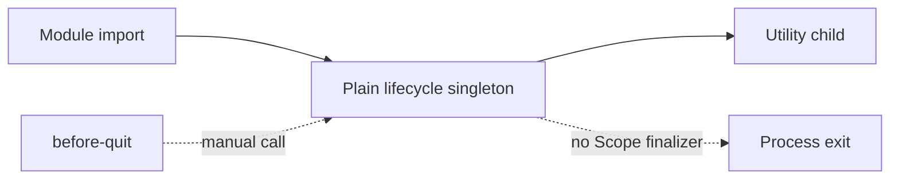
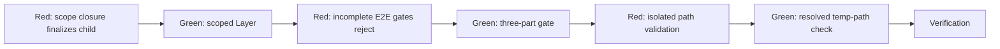
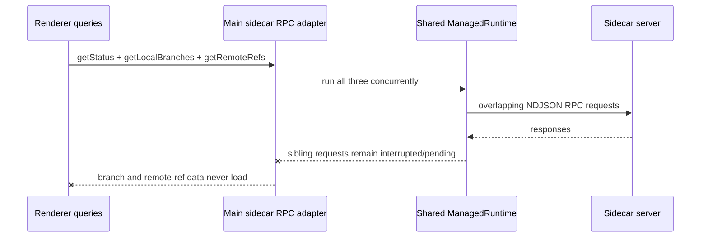
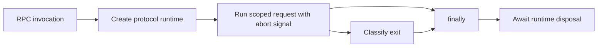

# Main Lifecycle And E2E Control Review

## Problem Statement

Review and remediate the final main-process lifecycle and E2E-control standards findings under
ADR-0001 without changing the E2E harness. Preserve the one-app E2E model, use strict TDD for
lifecycle behavior, remove prohibited production comments, and verify main tests, E2E where needed,
typechecking, and Biome.

## Scope

| Area | Files |
|---|---|
| Sidecar ownership | `src/main/sidecar-lifecycle.ts`, `src/main/sidecar.ts` |
| Recovery and shutdown | `src/main/recovery.ts`, `src/main/recovery-decision.ts`, `src/main/shutdown.ts`, `src/main/index.ts` |
| E2E control and store reset | `src/main/e2e-control.ts`, `src/main/store.ts`, `src/main/index.ts` |
| Tests | Corresponding `src/main/__tests__` files |

The E2E harness is read-only for this task.

## Governing Decision

`docs/adr/0001-effect-everywhere.md` requires logic, effects, and resource lifecycles in main and the
sidecar to use Effect. Process-global singletons must be Effect services behind a `Layer`, even when
there is only one adapter.

## Confirmed Findings

### 1. Sidecar Lifecycle Is Not Effect-Owned

`src/main/sidecar.ts` constructs one module-level `createSidecarLifecycle` value. Its Promise state
machine does stop a starting or running child, but no Effect scope owns that state machine or its
finalizer. This conflicts directly with ADR-0001.



The practical minimal conversion is to expose the lifecycle as an Effect service in a scoped Layer,
create one main-process `ManagedRuntime` at the composition root, and dispose that runtime during
shutdown. Layer scope closure then becomes the owner of child cleanup rather than shutdown relying
only on an unrelated exported function call.

### 2. E2E Control Has A Destructive Process-Global Surface

`src/main/e2e-control.ts` installs `globalThis.__REBASE_E2E_CONTROL__` whenever argv contains
`--e2e`. Its `replaceStore` method replaces the complete persisted store. A production launch with
that argument can therefore destroy real settings.

The existing read-only harness contract is:

```text
ElectronApplication.evaluate
  -> globalThis.__REBASE_E2E_CONTROL__
  -> replaceStore / inspectLifecycle
```

The harness already launches with all available isolation evidence:

| Gate | Harness value |
|---|---|
| Environment | `NODE_ENV=test` |
| Explicit mode | exact `--e2e` argument |
| Storage | `--user-data-dir=<mkdtemp rebase-e2e-user-data-...>` |
| Concurrency | one Playwright worker and one live app |

Because the harness may not be edited, removing the global key would break its current
`ElectronApplication.evaluate` callbacks. The compatible boundary is to require all three gates and
install nothing otherwise. The isolated user-data check must validate a resolved directory under the
OS temporary directory with the harness prefix, not merely trust the presence of a command-line
switch.

### 3. No Preload Exposure Exists

`src/preload/index.ts` exposes neither the E2E control key nor store replacement. The control is
reachable only from Playwright's main-process `ElectronApplication.evaluate`, not renderer code.
This invariant must remain unchanged.

### 4. Production Comments In Owned Files

Owned production files contain explanatory comments that violate the repository-wide default of no
comments. The affected logic can be made self-explanatory through names and should not retain those
comments.

## Proposed Test Seams

Strict TDD will exercise only these public seams:

| Seam | Behavior |
|---|---|
| Scoped sidecar lifecycle Layer | Closing its scope stops an in-progress or running child exactly once |
| Sidecar lifecycle service | Concurrent start/restart behavior remains serialized; shutdown rejects later starts |
| `installE2eControl` | Installs only when test environment, `--e2e`, and isolated user-data all match |
| Recovery decision | Intentional shutdown/clean exit never logs or respawns; unexpected sidecar crash does |

No tests will inspect private state or mock Electron lifecycle objects.

## TDD Sequence



Each red test will be run and observed failing before its implementation change.

## Files Inspected

- `docs/adr/0001-effect-everywhere.md`
- `CONTEXT.md`
- `src/main/sidecar-lifecycle.ts`
- `src/main/sidecar.ts`
- `src/main/e2e-control.ts`
- `src/main/store.ts`
- `src/main/index.ts`
- `src/main/recovery.ts`
- `src/main/recovery-decision.ts`
- `src/main/shutdown.ts`
- `src/preload/index.ts`
- Current main lifecycle/control tests
- `e2e/fixtures.ts` and `playwright.config.ts` (read-only)

## Commands Run

```sh
git status --short --branch
git log --oneline -10
git diff -- <owned main files and tests>
pnpm exec vitest run --config vitest.main.config.ts src/main/__tests__/sidecar-lifecycle.test.ts
pnpm exec vitest run --config vitest.main.config.ts src/main/__tests__/e2e-control.test.ts
pnpm test:main
pnpm typecheck
pnpm check
git diff --check
pnpm build
pnpm exec playwright test e2e/app-launches.spec.ts --grep="window becomes visible|shows the onboarding" --reporter=line
```

## Worktree Assumptions

The worktree contains extensive existing changes from the larger review remediation. Many owned files
are already modified or untracked. Those changes are treated as user/other-agent work and will be
preserved; edits will build on the current contents rather than reverting to `HEAD`.

## Current Status

Implementation and verification are complete for the agreed scope. No commit was created.

## Final Implementation

| File | Outcome |
|---|---|
| `src/main/sidecar-lifecycle.ts` | Added a generic scoped Layer constructor whose release finalizer shuts down the serialized lifecycle |
| `src/main/sidecar.ts` | Replaced the plain lifecycle module singleton with a `Context.Tag` service in one `ManagedRuntime`; runtime disposal is the shutdown path |
| `src/main/e2e-control.ts` | Requires `NODE_ENV=test`, exact `--e2e`, and a canonical temporary `rebase-e2e-user-data-*` path before installing the control |
| `src/main/index.ts` | Supplies the environment and Electron user-data path to the gate and retains graceful runtime disposal during quit |
| `src/main/recovery-decision.ts` | Removed prohibited production comments while retaining tested shutdown/crash classification |
| Main tests | Added scoped running/startup finalization and all E2E gate behavior |

`src/preload/index.ts` remains unchanged and contains no E2E control or store-replacement exposure.

## TDD Evidence

| Slice | Observed red | Green implementation |
|---|---|---|
| Scoped lifecycle | `createSidecarLifecycleLayer is not a function` | `Layer.scoped` plus `Effect.acquireRelease` finalizer |
| Test environment gate | `--e2e` installed the control under `NODE_ENV=production` | Require `nodeEnv === 'test'` |
| Isolated profile gate | Persistent user-data path still received the control | Canonical temp containment plus required basename prefix |
| macOS integration | Focused E2E reported the control unavailable | Compare real filesystem paths so `/var` and `/private/var` identify the same isolated directory |

The lifecycle tests verify scope disposal stops both a running child and a child owned by an
in-progress start exactly once. Existing serialization tests continue to cover concurrent start,
restart backoff, and shutdown waiting.

## Verification Outcome

| Check | Result |
|---|---|
| Full main tests | 22 files, 155 tests passed |
| Project typecheck | Passed |
| Full Biome check | 308 files passed |
| `git diff --check` | Passed |
| Production build | Passed |
| Direct app launch/onboarding E2E | 2 passed using one worker and the unchanged shared-app harness |

The build retains its pre-existing warning that `theme-init.js` cannot be bundled without a module
attribute. It is unrelated to this scope.

## E2E Limitation

A broader focused run exercised launch, onboarding, two-repo isolation, and persistence. The control
gate worked, but `tabs.spec.ts` timed out waiting for the unrelated `extra.txt` status row. The same
test was rebuilt and rerun with the Effect runtime temporarily replaced by the prior direct lifecycle
call; it failed identically at the same locator and teardown. The scoped Layer was then restored.

The persistence scenario's assertions also completed in one run but its existing harness teardown
timed out while closing tracked repos. Because the harness is explicitly read-only and the A/B check
excluded the Effect runtime as the cause of the deterministic status-row failure, a full E2E run was
not useful and was not attempted. No harness or renderer files were changed.

## Accepted Exception

`globalThis.__REBASE_E2E_CONTROL__` remains because the unchanged harness obtains the main-process
test API through `ElectronApplication.evaluate` and that exact key. Removing it requires a coordinated
harness contract change, which this task prohibits. The retained surface is accepted only with all of
these constraints:

1. `NODE_ENV` must equal `test`.
2. argv must contain the exact `--e2e` token.
3. Electron's canonical user-data path must resolve inside the OS temporary directory.
4. The user-data basename must start with `rebase-e2e-user-data-`.
5. The preload exposes no control key or store-reset operation.

This is the narrowest compatible boundary for the current one-app E2E harness. Production launches,
including launches that receive only `--e2e`, do not install the destructive control.

## Remaining Risk

The compatibility key still exists in the production main bundle, although it is unreachable without
all three test gates and is not renderer/preload-visible. A future coordinated harness change can
replace it with a non-global Playwright main-process seam and remove this exception entirely.

## Sidecar Data-Loading Follow-Up

### Problem

The branches E2E deterministically failed because the ref tree never received local branch data. All
four scenarios timed out waiting for `main current` or `feature`, and their fixture teardown then
stalled while closing the repository.



### Root Cause

`src/main/sidecar-rpc.ts` cached one `ManagedRuntime` for a sidecar URL and bearer token and reused it
across overlapping RPCs and streams. The runtime owns the HTTP RPC protocol transport; sharing that
transport across independent concurrent invocations coupled their scopes and interruption state. The
normal repository bootstrap issues `getStatus`, `getLocalBranches`, and `getRemoteRefs` concurrently,
so one response could complete while sibling calls remained pending until cancellation or timeout.

The prior unit assertion that two calls construct one runtime encoded the faulty implementation as a
requirement and used a module mock instead of exercising the transport boundary.

### Regression Evidence

The implementation-count test was removed. A main-process integration test now starts the real
`createSidecarServer`, opens one Git fixture, concurrently invokes the three bootstrap reads through
`callRpcByTag`, and requires all three to return `Ok` within their one-second transport bounds.

| State | Focused main/sidecar regression | Branches E2E |
|---|---|---|
| Before fix | `getLocalBranches` failed after one second; `getRemoteRefs` was also interrupted | 4 failed waiting for branch data |
| After fix | 6 tests passed, including all three concurrent reads | 4 passed |

### Outcome

Each non-stream RPC and each stream invocation now creates its own `ManagedRuntime` and awaits
`runtime.dispose()` in `finally`. The existing per-call timeout, caller abort signal composition,
scoped RPC effect, derived error classification, stream interruption behavior, and separately scoped
process-global sidecar lifecycle remain unchanged.



No Electron object is mocked by the regression, and no E2E harness changes were needed.

### Follow-Up Verification

| Check | Result |
|---|---|
| Focused main/sidecar regression before fix | Failed: `getLocalBranches` timed out and `getRemoteRefs` was interrupted |
| Focused main/sidecar suite after fix | 6 passed |
| Existing sidecar RPC lifetime suite | 27 passed |
| Branches E2E before fix | 4 failed |
| Branches E2E after fix | 4 passed |
| Full main tests | 22 files, 155 tests passed |
| Project typecheck | Passed |
| Full Biome check | 308 files passed |
| Production build | Passed with the pre-existing `theme-init.js` module-attribute warning |

The follow-up is complete. No commit was created.
