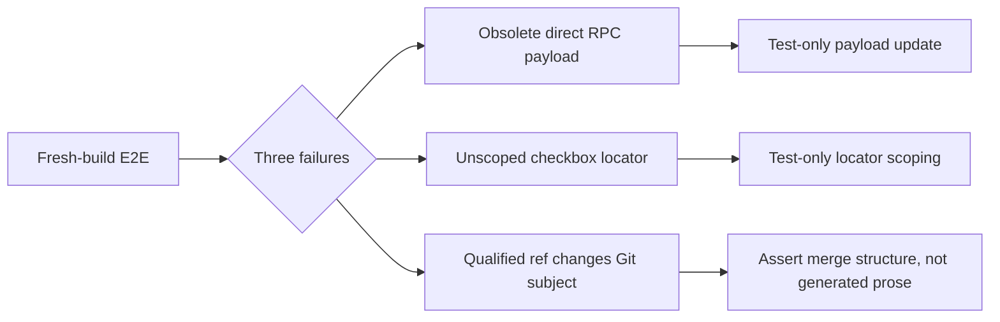
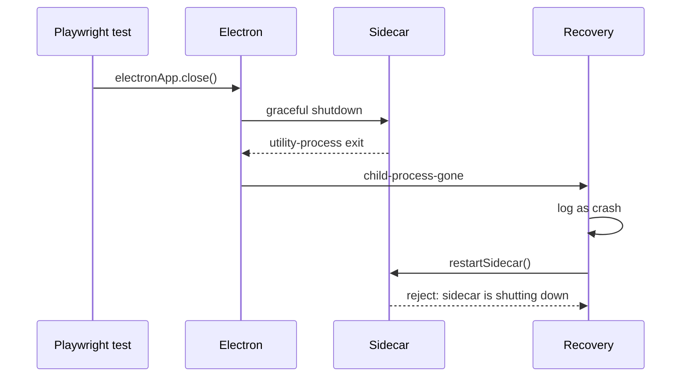

# Review Remediation E2E Diagnosis

## Problem Statement

The full fresh-build Electron E2E run completed 33 tests and failed three after the review
remediation work:

| Test | Symptom |
|---|---|
| `app-launches.spec.ts` merge conflict RPC | Main threw `SidecarRpcError` before returning typed `Conflict` |
| `amend.spec.ts` whole-file drop | A global checkbox locator matched two elements |
| `merge.spec.ts` clean merge | Expected generated subject `Merge branch 'feature'` was absent |

## Current Status

All three failures were reproduced and minimized. They were stale or ambiguous E2E assertions, not
production behavior failures. The approved test-only corrections have now been applied.



## Feedback Loop

The red-capable focused command is:

```sh
pnpm exec playwright test e2e/app-launches.spec.ts e2e/amend.spec.ts e2e/merge.spec.ts \
  --grep="a merge conflict flows|drops a file from|merging a non-conflicting" \
  --reporter=line
```

It reproduces the same three failures from the full suite without unrelated scenarios.

## Timeline

| Step | Evidence |
|---|---|
| Full verification | `pnpm test:e2e` failed 3 of 37 tests; 33 passed and one was skipped after failure |
| Artifact inspection | Amend snapshot showed one status row plus its selected-file diff control |
| Artifact inspection | Merge snapshot showed a three-commit Timeline and a two-parent merge |
| Contract comparison | Direct E2E payload used `{ ref }`; current `MergeBranch` requires `{ refKind, fullPath }` |
| Focused reproduction | All three exact failures reproduced with the focused Playwright command |
| Seam checks | Sidecar conflict, main classification, and renderer typed merge client tests passed |

## Files Inspected

- `e2e/app-launches.spec.ts`
- `e2e/amend.spec.ts`
- `e2e/merge.spec.ts`
- `e2e/fixtures.ts`
- `src/shared/rpc.ts`
- `src/main/sidecar-rpc.ts`
- `src/sidecar/rpc-handlers.ts`
- `src/sidecar/operations.ts`
- `src/sidecar/conflict.ts`
- `src/renderer/lib/rpc-client.ts`
- `src/renderer/components/StatusPanel/FileRow.tsx`
- `src/renderer/components/DiffPanel/index.tsx`
- `src/renderer/WorkspaceViews.tsx`
- Playwright `error-context.md` artifacts for the amend and merge failures

## Confirmed Findings

### 1. Direct RPC Fixture Uses The Old Merge Contract

`e2e/app-launches.spec.ts` bypasses the typed renderer client and submits `{ repoPath, ref }`.
`MergeBranch` now requires `{ repoPath, refKind, fullPath }`. Decoding fails before Git runs, so the
main process correctly surfaces transport failure rather than typed `Conflict`.

Proposed correction: submit `refKind: 'local'` and `fullPath: 'feature'` in both direct calls.

### 2. Amend Drop Locator Matches Two Legitimate Controls

The amend lands, `HEAD:feature.txt` is absent, the `Amended` toast appears, and one untracked status
row exists. The selected-file diff header also provides a stage checkbox. Both controls are named
`Stage feature.txt`, so the global role locator violates Playwright strict mode.

```text
Local changes
+- Status row: Stage feature.txt
`- Selected diff header: Stage feature.txt
```

Proposed correction: use the existing `fileRowCheckbox(page, 'feature.txt')` helper, which scopes the
assertion to `status-file-row`.

### 3. Qualified Ref Correctly Changes Git's Generated Subject

The clean merge succeeds. The artifact contains `Timeline 3 commits`, `Merge commit with 2 parents`,
and `Merge branch 'refs/heads/feature'`. Fully qualified merge targets are required to prevent
branch/tag/remote short-name collisions, so reverting to an ambiguous target is unsafe.

Proposed correction: remove the assertion against Git-generated prose. Existing assertions verify
the behavior that matters: a two-parent merge appears and Timeline count grows.

## Hypotheses

| Rank | Hypothesis | Prediction | Result |
|---:|---|---|---|
| 1 | Direct fixture drifted from the RPC contract | Typed renderer path passes while direct E2E fails decoding | Confirmed |
| 2 | Amend produced duplicate status rows | Snapshot contains two list rows | Discarded; only one list row exists |
| 3 | Amend invalidation did not refresh status | Dropped file or toast is absent | Discarded; both are present |
| 4 | Clean merge did not refresh history | No merge row or three-commit count appears | Discarded; both appear |
| 5 | Ref qualification changed generated text | Merge structure is correct but subject contains full ref | Confirmed |

## Commands Run

```sh
pnpm test:e2e
pnpm exec playwright test e2e/app-launches.spec.ts e2e/amend.spec.ts e2e/merge.spec.ts \
  --grep="a merge conflict flows|drops a file from|merging a non-conflicting" \
  --reporter=line
```

Focused sidecar conflict, main classification, and renderer RPC tests were also run and passed.

## Proposed Changes

| File | Change | Production behavior |
|---|---|---|
| `e2e/app-launches.spec.ts` | Use required merge ref identity fields | None |
| `e2e/amend.spec.ts` | Scope stage-checkbox assertion to status row | None |
| `e2e/merge.spec.ts` | Assert merge structure instead of Git-generated subject | None |

All three proposed changes were approved and applied on 2026-07-21.

## Verification Completion

1. The focused remediation and shared-harness feedback loops passed.
2. The final fresh-build Playwright run passed all 38 listed scenarios.
3. Project typechecking, strict E2E typechecking, focused Biome, and owned-file
   `git diff --check` passed.
4. A standalone Electron launch outside the shared fixture rendered onboarding and completed a
   cancelled `Select Working Folder` interaction successfully.

## Remaining Risks

- Direct `sidecarRequest` calls in E2E are intentionally weakly typed and can drift again. The
  contract test protects production callers, while this E2E protects the preload/main transport.
- Git-generated merge subjects are not an application API and can vary with qualified targets,
  configuration, or Git version. Structural merge assertions are more stable.

## Recommended Next Action

Approve the three test-only corrections, then rerun focused and full E2E verification.

---

## Shared Application Investigation

### User Report

During the full E2E run, many Electron applications opened and logs repeatedly reported sidecar
shutdown or respawn errors. The requested direction is one shared application instance for all
scenarios.

### Measured Lifecycle

`pnpm exec playwright test --list` reports 37 scenarios across 13 files. The current fixture is
test-scoped and ordinary setup calls `relaunch`, producing this successful-run total:

| Source | Electron launches | Sidecars |
|---|---:|---:|
| Test-scoped harness | 29 | 29 |
| Setup and explicit relaunch calls | 30 | 30 |
| Custom `app-launches.spec.ts` lifecycle | 2 | 2 |
| **Total** | **61** | **61** |

Local Playwright uses four workers, so up to four Electron/sidecar pairs run concurrently. Unique
`--user-data-dir` values place them in separate single-instance domains, bypassing the application's
normal single-instance lock.



### Confirmed Shutdown Defect

The noise is not only test volume. During `before-quit`, `killSidecar()` marks the lifecycle as
shutting down. The expected utility-process exit reaches recovery, which logs it as an error and
attempts restart. Restart then correctly rejects with `sidecar is shutting down`.

Relevant paths:

- `src/main/index.ts`
- `src/main/sidecar-lifecycle.ts`
- `src/main/recovery.ts`
- `src/main/recovery-decision.ts`

Recovery must classify application shutdown and clean sidecar exit before logging or respawning.

### Isolation Constraints

Process teardown currently supplies test isolation. One shared process must explicitly reset:

| Resource | Required cleanup |
|---|---|
| Sidecar repo sessions and continuations | Cancel streams and close every tracked repo |
| Main repo watchers and lifecycle queues | Await repo close before deleting fixture directories |
| `electron-store` | Restore all schema defaults atomically |
| Renderer query/module state | Reload after exact store seeding |
| `localStorage` | Restore theme and resize state defaults |
| Main `dialog` stubs | Restore the original method after each scenario |

### Proposed Architecture

1. Set Playwright to one worker and disable full parallelism.
2. Launch one worker-scoped mutable Electron application with one shared user-data directory.
3. Keep repositories and scenario state test-scoped.
4. Before each scenario, atomically reset persisted state and reload the renderer.
5. After each scenario, cancel streams, close repo sessions, restore dialog behavior, reset storage,
   reload to a repo-free page, then delete fixture repositories.
6. Add a main-process-only E2E control seam guarded by an explicit `--e2e` switch. Do not expose it
   through preload or `window.electronAPI`.
7. Fix recovery classification so intentional shutdown does not log or restart.
8. Keep one real process restart only for the existing persistence-across-restart scenario.

### Instance Target

The robust default is **one live application at a time and two total launches**:

| Purpose | Launches |
|---|---:|
| Shared application for all scenarios | 1 |
| One intentional persistence restart | 1 |

If the requirement is literally one total OS process, the persistence scenario must be weakened to
a renderer reload and no longer proves state survives an application restart.

### Acceptance Criteria

1. All 38 scenarios remain listed and pass, including the teardown failure-path regression.
2. A clean run uses one Playwright worker.
3. At most one Electron application and one sidecar are alive concurrently.
4. A successful run performs one shared launch plus at most one intentional persistence relaunch.
5. Every scenario begins with exact default store and renderer state unless it explicitly seeds data.
6. Repositories are closed before fixture directories are removed.
7. The persistence scenario observes a changed main PID and preserved tab/theme state.
8. E2E stderr contains no `sidecar is shutting down`, `sidecar respawn failed`, or error-level log
   for an intentional child exit.
9. Recovery unit tests retain respawn for unexpected sidecar crashes.
10. Two consecutive full E2E runs pass without state accumulation.

### Stash Race Found During Verification

The remaining stash E2E failure is a separate production race amplified by parallel load. Staging
updates the cache optimistically; before its mutation coordinator releases, the stash control stays
clickable. Confirming stash then silently loses the coordinator race and closes its dialog without
running Git. The intended staged-only stash behavior is correct when invoked.

The fix is to disable both stash entry points while the repository mutation coordinator is busy and
retain the E2E clean-tree assertion as a synchronization barrier.

### Proposed Files

- `playwright.config.ts`
- `e2e/fixtures.ts`
- `e2e/app-launches.spec.ts`
- `e2e/tabs.spec.ts`
- `e2e/isolation.spec.ts`
- `src/main/e2e-control.ts`
- `src/main/index.ts`
- `src/main/store.ts`
- `src/main/recovery.ts`
- `src/main/recovery-decision.ts`
- Main lifecycle/control tests
- Stash control and renderer store tests

### Current Status

Diagnosis and architecture design are complete. The approved main-process lifecycle classification and
E2E control seam have been implemented. Shared-instance harness changes remain outside this change.

### Main-Process Implementation

| File | Change |
|---|---|
| `src/main/recovery-decision.ts` | Classify intentional shutdown and clean sidecar exit before log/respawn decisions |
| `src/main/recovery.ts` | Apply the classifier and count successful unexpected sidecar respawns |
| `src/main/index.ts` | Mark shutdown synchronously and install the explicitly gated E2E control |
| `src/main/store.ts` | Replace the complete store with defaults plus overrides through one atomic store assignment |
| `src/main/e2e-control.ts` | Expose main PID, named-sidecar PIDs/count, respawn count, and store replacement only under `--e2e` |
| Main unit tests | Cover shutdown, clean exit, crash recovery, gating, store delegation, and lifecycle inspection |

The main-process harness API is installed at `globalThis.__REBASE_E2E_CONTROL__` only when the Electron
command line contains the exact `--e2e` argument. `replaceStore(overrides?)` restores every default and
applies optional seed values in the same atomic write. `inspectLifecycle()` returns `mainPid`,
`sidecarPids`, `sidecarProcessCount`, and `sidecarRespawnCount`.

### Main-Process Verification

```sh
pnpm exec vitest run --config vitest.main.config.ts \
  src/main/__tests__/recovery-decision.test.ts \
  src/main/__tests__/e2e-control.test.ts \
  src/main/__tests__/shutdown.test.ts \
  src/main/__tests__/sidecar-lifecycle.test.ts
pnpm exec tsc -p tsconfig.node.json --noEmit
pnpm exec biome check src/main/recovery.ts src/main/recovery-decision.ts src/main/index.ts \
  src/main/store.ts src/main/e2e-control.ts src/main/__tests__/recovery-decision.test.ts \
  src/main/__tests__/e2e-control.test.ts
```

The focused run passed 20 tests across four files. Node typechecking and focused Biome checks passed.
Shared-harness implementation and full E2E verification are still required after the E2E owner adopts
the control seam.

---

## Shared Application Implementation Outcome

The shared-instance E2E harness now uses the guarded main control seam.

### Harness Changes

| File | Outcome |
|---|---|
| `playwright.config.ts` | Enforces one worker and disables full parallelism |
| `e2e/fixtures.ts` | Owns one worker-scoped mutable app/page and one shared user-data directory |
| `e2e/app-launches.spec.ts` | Uses the shared fixture with no custom process or serial group |
| `e2e/tabs.spec.ts` | Verifies ordinary reload PID stability and intentional restart PID change |
| `e2e/theme.spec.ts` | Uses renderer reload rather than process relaunch |

Each test receives exact default store and local-storage state. Teardown cancels streams, awaits repo
closure, restores the folder dialog, resets persisted state, reloads to a repo-free renderer, and only
then deletes fixture paths. Ordinary `openRepo` and `openTabs` calls seed through the gated main control
and reload the renderer.

The tabs/theme persistence scenario is the only process restart. It closes the renderer while the
sidecar is live, closes and relaunches Electron against the same user-data directory, and asserts a new
main PID with preserved tabs and theme.

### Lifecycle Instrumentation

The worker fixture fails when it observes more than one live Electron application, more than two total
launches, a final sidecar count other than one, any sidecar respawn, or known intentional-shutdown error
messages on stderr. The onboarding scenario verifies exact renderer-visible defaults.

The initial lifecycle assertion failed before implementation because ordinary `openTabs` changed the
main PID from `87544` to `87756`. After the shared-worker conversion, the focused lifecycle set passed.
An initial persistence run exposed shutdown-time renderer RPCs; closing the renderer before the one
intentional process restart quiesced those requests without changing persisted state.

### Shared-Harness Verification

```sh
pnpm exec playwright test --list
pnpm build
pnpm exec playwright test e2e/app-launches.spec.ts e2e/tabs.spec.ts \
  --grep="window becomes visible|shows the onboarding|two repos in tabs stay isolated|persisted tabs and theme" \
  --reporter=line
pnpm exec playwright test e2e/amend.spec.ts e2e/history.spec.ts e2e/staging-commit.spec.ts \
  e2e/stash.spec.ts e2e/tabs.spec.ts \
  --grep="drops a file from|resets the branch|stages a file via|Stage all|selecting a modified|stashes staged|two repos in tabs stay isolated" \
  --reporter=line
pnpm exec playwright test --reporter=line
pnpm exec playwright test --reporter=line
```

| Check | Result |
|---|---|
| Scenario listing | 38 tests across 14 files |
| Focused lifecycle/isolation | 4 passed |
| Focused status-row regression set | 7 passed |
| Consecutive full run 1 | 37 passed |
| Consecutive full run 2 | 37 passed |
| E2E harness strict TypeScript check | Passed |
| Project typecheck | Passed |
| Project Biome check | Passed |
| `git diff --check` on owned files | Passed |

All shared-application acceptance criteria are implemented and verified. No E2E blocker remains.

---

## Final Test-Infrastructure Follow-Up

### Failure-Safe Teardown

Both fixture scopes now run setup/use and teardown through `runWithFailureSafeCleanup`. The helper
retains the operation error or first teardown assertion while attempting every later cleanup step.
Per-test cleanup independently attempts repository closure, dialog restoration, store replacement,
renderer storage clearing, reload, and fixture removal. Repository paths remain registered with the
worker until close succeeds, giving worker teardown a final close/remove attempt before Electron and
the shared user-data directory are removed.

When Playwright has already recorded an unexpected test failure or timeout, secondary test-fixture
cleanup errors are suppressed after cleanup completes, so they cannot replace the original assertion.
`e2e/fixture-teardown.spec.ts` injects lifecycle and close-repository failures, verifies every later
step runs, and verifies the original lifecycle error object is retained.

### Test Project Boundary

The real HTTP/sidecar stream adapter test moved from
`src/main/__tests__/sidecar-stream-log.test.ts` to
`src/sidecar/__tests__/main-sidecar-stream-log.integration.test.ts`. `vitest.main.config.ts`
explicitly excludes integration-named tests, while the sidecar project discovers the moved test with
its 15-second test and hook timeouts. CI's `test:sidecar` step is named `Sidecar and integration tests`
to make that boundary visible.

### Direct Electron Interaction

A fresh production build was launched directly through Electron, without the shared E2E fixture or
the `--e2e` control flag. The onboarding heading and folder button were visible, the window reported
visible, and clicking `Select Working Folder` through a cancelled native dialog left onboarding
responsive.

```json
{"title":"Rebase","onboardingVisible":true,"folderButtonVisible":true,"windowVisible":true}
```

### Final Verification

| Check | Result |
|---|---|
| Playwright listing | 38 tests across 14 files |
| Controlled teardown plus focused Electron harness | 3 passed |
| Focused history timeout regressions | 3 passed |
| Main project | 21 files, 150 tests passed; no real-sidecar integration discovered |
| Sidecar and integration project | 37 files, 314 tests passed, including the moved 6-test integration |
| Project and strict E2E typechecks | Passed |
| Production build | Passed with the existing `theme-init.js` module-attribute warning |
| Standalone direct Electron interaction | Passed with the result above |
| Final full E2E | 38 passed in one worker in 1.9 minutes |
| Focused Biome for discovered owned files | Passed |
| Owned-file `git diff --check` | Passed |

The first full 38-scenario attempt passed 36 tests and hit Playwright's default 30-second deadline in
two history scenarios. Their focused rerun passed after `playwright.config.ts` set an explicit
60-second Electron E2E timeout; the subsequent full run passed all 38 scenarios. The timeout failure
also confirmed that teardown continued into later scenarios instead of abandoning the shared app.

### Completed Remediation Verification

After the final rename, canonical-owner, worker-generation, lifecycle-registry, and teardown fixes:

| Check | Final result |
|---|---|
| Renderer | 604 tests passed |
| Main/shared | 154 tests passed |
| Sidecar/integration | 319 tests passed |
| Electron E2E | 39 tests passed with one worker and one live app |
| Intentional relaunches | One persistence relaunch |
| Sidecar shutdown/respawn errors | None |
| Repository data loading | Branches, status, refs, and history verified in E2E |
| Smoke startup | Passed |
| Direct Electron interaction | Passed |
| `pnpm check`, `pnpm typecheck`, `git diff --check` | Passed |

The shared harness now retains a fixture repository after a failed close and removes it only after
repository closure or successful application shutdown. No verification blocker remains.

---

## Final Owner-Qualified Teardown Outcome

### Blocker

The shared E2E fixture called preload `closeRepo(repoPath)` without the required owner token. Main's
lifecycle queue therefore rejected the release as non-owning, but the fixture still treated the repo
as closed and removed its directory. UI-owned repo sessions could remain live in the sidecar between
tests.

### TDD Evidence

The first change only added the public postcondition: call the allowed `getStatus` sidecar read for
every tracked repo and require `RepoNotOpen`. No cleanup ordering changed in that red step.

```text
restored repo renders branches and history in the UI
expected RepoNotOpen, received Ok
```

The focused Playwright run failed at fixture teardown, proving the regression detected the ownerless
close. The green implementation removed the fixture's direct close entirely. Cleanup now closes repo
tabs through the production UI, waits for each production `RepoSession` to finish its owner-qualified
release while the renderer is alive, resets the complete persisted store and renderer storage,
reloads, and verifies `RepoNotOpen` again before `reposClosed` can become true or fixture paths can be
removed.

The first full green attempt found one additional race in the existing-tab routing scenario: the tab
had unmounted, but reload could destroy the renderer before its deferred close IPC completed. Waiting
for `RepoNotOpen` after tab reset, while retaining the required post-reload verification, closed that
race without introducing a privileged teardown bypass.

### Changed E2E Paths

| File | Final behavior |
|---|---|
| `e2e/fixtures.ts` | Production tab unmount owns closure; allowed reads verify every tracked repo before and after reset/reload; fixture removal remains gated on verified closure or app shutdown |
| `e2e/fixture-teardown.spec.ts` | Opens a repo with an explicit owner, proves a still-open session fails closure verification and retains its path, then proves the matching owner closes it |
| `e2e/app-launches.spec.ts` | All direct IPC open/close pairs use explicit matching numeric owner tokens |

`runWithFailureSafeCleanup` and `runWithFailureSafeFixtureTeardown` retain their original-error and
first-cleanup-error behavior. Every cleanup step is still attempted independently. If verification
fails, the repo remains worker-tracked; worker teardown can still close the application before fixture
removal.

### Final Verification

| Check | Result |
|---|---|
| Red focused restored-repo E2E | Failed as expected with `Ok` instead of `RepoNotOpen` |
| Focused affected E2Es | 10 passed |
| Focused existing-tab race and ownership regression | 2 passed |
| Full Electron E2E | 39 passed in one worker |
| Project typecheck | Passed |
| Strict E2E TypeScript check | Passed |
| Biome | 310 files checked, passed |
| `git diff --check` | Passed |

The production build passed with the existing `theme-init.js` module-attribute warning. The sole
final-review blocker is resolved, and no commit was created.
