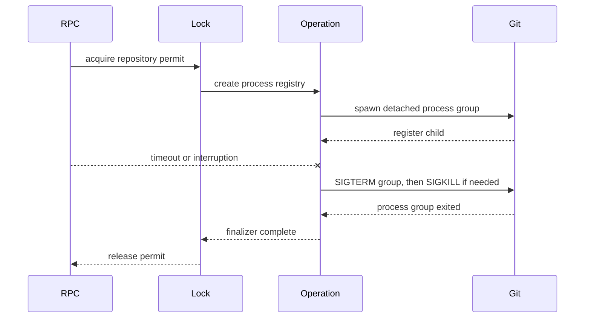

# Sidecar Cancellation And History Continuation

## Problem Statement

Fix combined review items 11, 12, 35, and 44 in the current tree without disturbing concurrent
lifecycle work. Every Git child started by a locked repository operation must receive interruption
and timeout cancellation, and the repository permit must remain held until the process group exits.
History pagination must avoid repeated `--skip` traversal while preserving the streaming RPC shape.

## Scope

| Area | Files |
| --- | --- |
| Process runner | `src/sidecar/spawn.ts` |
| Repository operation lifetime | `src/sidecar/repo-lock.ts` |
| SimpleGit process registration | `src/sidecar/git/instances.ts` |
| Network Git commands | `src/sidecar/sync.ts` |
| History continuation | `src/sidecar/log-stream.ts` |
| Focused verification | Sidecar lock, instance, sync, and stream tests |

## Test Seams

| Seam | Assertion |
| --- | --- |
| `withRepoLock` plus cached `SimpleGit` | A real spawned process is terminated on timeout and a queued owner cannot enter early |
| `streamLog` RPC | Sequential pages remain one duplicate-free snapshot when a ref moves between pages |
| Shared Git runner through sync operations | Network helper process groups terminate and the operation settles |

## Initial Evidence

- The current partial tracker infers ownership from `git -C <repo>` arguments and a repo-wide active
  count. SimpleGit children do not pass through `spawnGit`, so they are invisible to it.
- `sync.ts` has a bespoke `spawn` path for fetch plus two wrappers over `spawnGit`.
- Push and pull explicitly disable the repository watchdog with `timeoutMs: null`.
- `log-stream.ts` starts a fresh `git log --skip=N` for every page. If a ref moves between pages,
  the numeric offset can duplicate or omit commits.
- Existing focused tests pass, so new regressions are required before implementation.

## Intended Flow

## Timeline

- Read the combined review, current target files, existing focused tests, RPC contract, renderer
  paging caller, and SimpleGit 3.36 process/plugin implementation.
- Confirmed current focused baseline: 19 tests pass across lock, instances, and stream RPC suites.
- Selected public behavior seams and began strict red-green cycles.
- Added a real SimpleGit process timeout test. It failed because the child was not registered with
  the lock operation.
- Added a moving-ref pagination test. It failed with 16 records for a 15-commit snapshot because
  numeric `--skip` replayed one commit after HEAD advanced.
- Replaced repo-count tracking with an operation-owned child registry and attached the pinned
  SimpleGit version's spawn lifecycle to it.
- Consolidated direct Git process creation on `startGit`; fetch retains its session-scoped finalizer
  while push, pull, log, and existing `runGit` users share the same process implementation.
- Extended termination from the direct process group to descendants after the real
  `remote-ext`/`sleep 30` integration exposed transport helpers that could outlive the Git parent.
- Replaced `--skip` with a snapshot-root/frontier continuation. Added moving-ref and merge-topology
  coverage, plus a five-minute expiry for abandoned continuations.
- Integrated the lifecycle-agent's main transport stream test with the now-required open repo
  session; its cancellation and real child-exit assertions then passed unchanged.

## Implemented Behavior

| Requirement | Result |
| --- | --- |
| Finite non-stream RPC lifetime | Main transport uses its existing `AbortSignal.timeout`; push and pull no longer disable the 120-second repo watchdog |
| Lock acquisition timeout | The watchdog now wraps permit acquisition as well as locked work |
| SimpleGit cancellation | Cached instances register every spawned child while their repo operation is active |
| Process lifetime | Git runs in a detached process group; timeout/interruption sends TERM, escalates to KILL, waits for the group and captured descendants, then releases the permit |
| Windows tree termination | Cancellation uses `taskkill /t /f` and waits for the direct process exit |
| Runner consolidation | `startGit` owns spawn, collection, process-group setup, registration, and termination; promise wrappers build on it |
| History complexity | Sequential pages pull from one retained process, making total Git traversal linear in loaded history rather than repeated prefix scans |
| History consistency | Every page consumes the exact sequence of one monolithic process; ref movement and elapsed wall-clock time cannot reorder, duplicate, or omit commits |
| RPC compatibility | `skip`, `maxCount`, `streamId`, chunk batching, lookahead `hasMore`, typed failures, and cancellation remain supported |

## Changed Files

| File | Change |
| --- | --- |
| `src/sidecar/spawn.ts` | Shared cancellation-aware runner, repo-operation registry, process-group and descendant termination |
| `src/sidecar/repo-lock.ts` | Watchdog around acquisition and work; cancellation and exit finalizers before permit release |
| `src/sidecar/git/instances.ts` | Pinned SimpleGit spawn plugins for detached groups and operation registration |
| `src/sidecar/sync.ts` | Shared runner for fetch/push/pull helpers and finite push/pull watchdogs |
| `src/sidecar/log-stream.ts` | Bounded process-backed snapshot continuation; no `git log --skip` |
| `src/sidecar/__tests__/repo-lock.test.ts` | Real descendant exit and permit-retention assertion |
| `src/sidecar/git/__tests__/instances.test.ts` | Real SimpleGit PID timeout assertion |
| `src/sidecar/__tests__/rpc-stream-log.test.ts` | Moving-ref and merge pagination assertions |
| `src/main/__tests__/sidecar-stream-log.test.ts` | Open/close fixture setup required by current stream session ownership |

## Verification

| Command / suite | Result |
| --- | --- |
| Seven focused sidecar files | 43/43 tests passed |
| Main RPC timeout and stream cancellation files | 30/30 tests passed |
| `pnpm typecheck` | Passed |
| `pnpm check` | Passed, 300 files |
| `git diff --check` | Passed |
| Focused V8 coverage | 87.13% statements/lines, 84.33% branches, 91.93% functions |

Focused per-file line coverage: `spawn.ts` 83.73%, `repo-lock.ts` 95.71%,
`git/instances.ts` 97.05%, `sync.ts` 85.65%, and `log-stream.ts` 88.20%.

The complete parallel sidecar run reached 295/298 before the real-process test startup windows were
widened for suite contention. Its other failure was the existing server push/pull test's 10-second
deadline; that test passed isolated in 2.56 seconds. After adjustment, all affected files passed in
the 43-test focused run; the entire 298-test suite was not rerun.

## Remaining Limitations

- SimpleGit exposes the child only through its internal plugin store. The integration is isolated in
  `git/instances.ts`, protected by real-process coverage, and tied to the repository's exact
  SimpleGit 3.36.0 pin, but a future dependency upgrade must revalidate this seam.
- Process-tree assertions ran on macOS. The Windows `taskkill` path is implemented and typechecked
  but was not exercised in this environment.
- Continuations are sidecar-memory state. A sidecar restart loses the snapshot because the existing
  RPC carries an offset rather than a durable cursor token.
- A non-sequential nonzero `skip` cannot identify an earlier snapshot. It replaces the current
  continuation and performs one prefix traversal against a newly started monolithic process.
- Unix descendant discovery uses the platform `ps` command. If that lookup fails, detached
  process-group termination remains active, but descendants that deliberately leave the group are
  only best-effort.

## Current Status

The original frontier continuation did not satisfy the follow-up requirement: separate
`git log --topo-order` invocations can choose different valid orders, and expiry discarded the
snapshot. SimpleGit reads outside `withRepoLock` also had no child owner after HTTP cancellation.

The follow-up replaces that design with:

- An `AsyncLocalStorage` request child registry spanning the complete sidecar HTTP response
  pipeline. SimpleGit and shared-runner children register with both the request owner and any active
  repo-lock owner through one tracked-process object, so either cancellation path terminates and
  awaits the same process group.
- A bounded one-continuation-per-repo pager that retains the actual monolithic
  `git log --topo-order` process, parser buffer, one-record lookahead, and offset across RPC pages.
  The process is reattached to each page request while reading and detached only after that page is
  materialized. Completed snapshots retain an inert terminal marker until restart or repo close, so
  a trailing request cannot fall into a newer ref snapshot.
- Explicit continuation cleanup on `closeRepo`; an unpaged or `skip=0` stream replaces the prior
  snapshot.

Follow-up verification:

| Command / suite | Result |
| --- | --- |
| Cancellation/history/lock focused suites | 41/41 passed |
| `pnpm typecheck` | Passed |
| `pnpm check` | Passed, 305 files |
| `pnpm test:sidecar` | 298/299 passed |

The sole full-suite failure is unrelated to this scope:
`src/sidecar/__tests__/rpc-staging.test.ts` expects a missing `hunkHeader` to fail the current
`StageHunk` payload schema, but the decoder returns `Right`. No commit, amend, stash, or branch
operation was performed.
