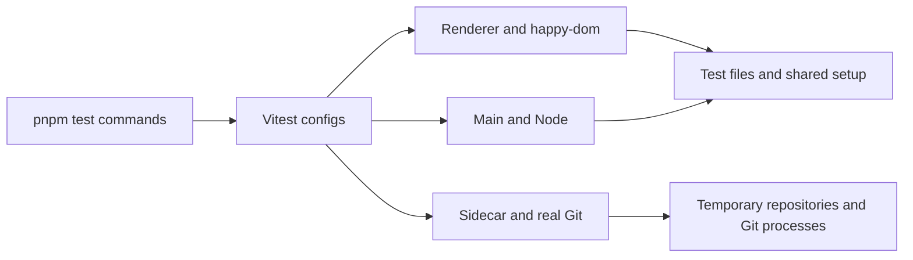
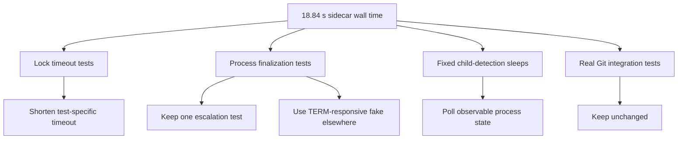

# Test Suite Performance Investigation

## Problem Statement

The automated tests feel slower than expected. Measure the existing suites, identify the dominant costs, and propose minimal optimizations that preserve coverage and behavior.

## Scope

- Renderer, main-process, and sidecar Vitest suites
- Shared Vitest configuration and setup
- Individual files or fixtures that dominate execution time
- No implementation changes until the findings are reviewed and approved

The Electron smoke and Playwright E2E suites will only be measured if the unit-suite evidence does not explain the reported slowness, because they include build and process-launch costs by design.

## Repository State Assumptions

- Working directory: `/home/alexandruion/code/rebase-git`
- Date: 2026-07-22
- Package manager: pnpm 11.2.2
- Required runtime: Node.js 24
- Profiled checkout: `a10ac2c feat: add Playwright MCP test mode`
- The shell exposed to the agent does not put pnpm on `PATH`; Corepack is available through the local Node installation.

## Investigation Timeline

| Time | Activity | Result |
| --- | --- | --- |
| Start | Created investigation handoff | Profiling started |
| Preliminary baseline | Ran all three Vitest suites with Node 22 | Results identified the likely bottlenecks but used an unsupported runtime |
| Blocker | Repository checkout changed externally | Paused rather than profiling a moving target |
| Resume | User restored the intended checkout | `HEAD` is `a10ac2c` |
| Supported baseline | Ran renderer suite with Node 24 | 53 files, 612 tests, 3.83 seconds wall time |
| Supported baseline | Ran main suite with Node 24 | 21 files, 154 tests, 3.92 seconds wall time |
| Supported baseline | Ran sidecar suite with Node 24 | 38 files, 319 tests, 18.84 seconds wall time |
| Implementation | Replaced fixed waits and shortened test-controlled timeouts | Coverage retained |
| Verification | Ran renderer suite with Node 24 | 53 files, 612 tests, 3.89 seconds wall time |
| Verification | Ran main suite with Node 24 | 21 files, 154 tests, 2.31 seconds wall time |
| Verification | Ran sidecar suite with Node 24 | 38 files, 319 tests, 13.97 seconds wall time |

## Current Architecture



## Files Inspected

- `package.json`
- `vitest.config.ts`
- `vitest.main.config.ts`
- `vitest.sidecar.config.ts`
- `playwright.config.ts`
- `src/test/setup.ts`
- `src/main/repoWatcher.ts`
- `src/main/__tests__/repoWatcher.test.ts`
- `src/sidecar/spawn.ts`
- `src/sidecar/__tests__/repo-lock.test.ts`
- `src/sidecar/__tests__/spawn-finalization.test.ts`
- `src/sidecar/__tests__/fetch-lock.integration.test.ts`
- `src/sidecar/__tests__/close-spares-mutation.integration.test.ts`
- `src/sidecar/git/__tests__/instances.test.ts`

## Commands Run

The preliminary run used Node 22.23.1 and emitted the expected unsupported-engine warning. After locating the workspace runtime, the authoritative baseline was repeated with Node 24.18.0:

```text
pnpm test:renderer
pnpm test:main
pnpm test:sidecar
```

No E2E or smoke suite was run.

Additional verification:

```text
pnpm typecheck
pnpm check
pnpm exec vitest run --config vitest.main.config.ts src/main/__tests__/repoWatcher.test.ts
pnpm exec vitest run --config vitest.sidecar.config.ts <five affected files>
```

## Evidence

### Node 24 Baseline

| Suite | Files | Tests | Wall time | Dominant file |
| --- | ---: | ---: | ---: | --- |
| Renderer | 53 | 612 | 3.83 s | `stores/__tests__/git.test.tsx`, 1.90 s |
| Main | 21 | 154 | 3.92 s | `main/__tests__/repoWatcher.test.ts`, 3.15 s |
| Sidecar | 38 | 319 | 18.84 s | Process-lifecycle timeout/finalization tests |

The repeated runs on Node 22 and Node 24 differed by less than 0.4 seconds per suite and identified the same files, so the bottlenecks are stable rather than runtime noise.

### Main Critical Path

```text
repoWatcher.test.ts
  4 x fixed startup wait                 1.60 s
  4 x production debounce               1.20 s
  Git and watcher event propagation     ~0.35 s
                                      ----------
  measured file time                    3.15 s
```

The fixed startup sleeps at `src/main/__tests__/repoWatcher.test.ts:166`, `:176`, `:255`, and `:287` compensate for chokidar readiness. The production watcher already has a real readiness signal, but `startWatching` does not expose it. The 300 ms debounce at `src/main/repoWatcher.ts:60` is application behavior and should remain covered with real time.

### Sidecar Critical Path

| File | Measured time | Avoidable wait |
| --- | ---: | ---: |
| `spawn-finalization.test.ts` | 4.83 s | One of two 2 s force-kill waits is unrelated to force-kill coverage |
| `repo-lock.test.ts` | 4.21 s | Explicit 3 s and 1 s test lock timeouts |
| `git/__tests__/instances.test.ts` | 3.12 s | Explicit 3 s test lock timeout |
| `fetch-lock.integration.test.ts` | 2.16 s | Two unconditional 1 s sleeps |
| `close-spares-mutation.integration.test.ts` | 1.06 s | One unconditional 500 ms sleep |

`src/sidecar/spawn.ts:6` intentionally uses a 2 second production grace period before `SIGKILL`. That behavior needs one real-time integration test. The public registry-finalizer test currently pays the same delay even though it only needs to prove that scope closure terminates and awaits children.



## Hypotheses

| Hypothesis | Status | Evidence |
| --- | --- | --- |
| A small number of integration-heavy files dominate runtime | Confirmed | Five sidecar files account for the avoidable critical path; one main file accounts for 80% of main wall time |
| Shared setup or worker startup is repeated unnecessarily | Low impact | Renderer setup/collection is parallel and total wall time is under four seconds |
| Tests contain avoidable fixed waits or serial process work | Confirmed | Four 400 ms watcher sleeps, two 1 second fetch sleeps, one 500 ms fetch sleep, and 1–3 second lock timeouts |

## Confirmed Findings

1. The renderer suite is not the primary bottleneck. Splitting pure tests out of happy-dom would add configuration complexity for a suite already under four seconds.
2. The main suite is almost entirely dominated by watcher readiness sleeps and the production debounce.
3. The sidecar suite is dominated by intentional timeout and force-kill paths rather than ordinary Git fixtures.
4. The slow waits verify important cancellation behavior, so they should be made event-driven or shortened only at explicit test-controlled boundaries, not removed.
5. E2E and smoke costs remain unmeasured and are outside the first optimization pass.

## Discarded Leads

- Raising the sidecar worker count globally is not recommended. Real Git process tests already contend for system resources, and the suite is capped at two workers intentionally.
- Reworking all Git fixtures is not justified. Even large real-Git files such as `amend.integration.test.ts` complete in about 2.64 seconds and overlap across workers.
- Splitting renderer logic into a second Vitest project is not justified by a 3.83 second wall time.

## Candidate Changes

Recommended minimal first pass:

1. Return watcher readiness from `startWatching` and await it in the four integration tests instead of sleeping 400 ms.
2. Reduce the three test-specific 3 second lock timeout paths and one 1 second path to a conservative 500 ms. The fake child writes its PID immediately, and each test still verifies cancellation and permit ordering.
3. Replace fixed fetch sleeps with polling for the actual transport child to appear and disappear.
4. Make the finalizer test's fake child TERM-responsive for registry-scope coverage while preserving the separate full 2 second escalation test.

Expected result: main should fall from about 3.9 seconds to 2.3 seconds, and sidecar should fall from about 18.8 seconds to roughly 10–12 seconds. Exact sidecar wall time depends on two-worker scheduling.

## Implemented Changes

| File | Change |
| --- | --- |
| `src/main/repoWatcher.ts` | Exposes and reuses watcher readiness without changing production debounce timing |
| `src/main/__tests__/repoWatcher.test.ts` | Awaits readiness instead of four 400 ms sleeps; linked-worktree refs retain a 50 ms Linux stabilization delay |
| `src/sidecar/__tests__/repo-lock.test.ts` | Uses 500 ms test-specific lock timeouts instead of 1–3 seconds |
| `src/sidecar/git/__tests__/instances.test.ts` | Uses a 500 ms test-specific lock timeout |
| `src/sidecar/__tests__/fetch-lock.integration.test.ts` | Polls for the real transport child to appear and disappear |
| `src/sidecar/__tests__/close-spares-mutation.integration.test.ts` | Polls for its uniquely identifiable transport child |
| `src/sidecar/__tests__/spawn-finalization.test.ts` | Keeps one full force-kill escalation test while making scope-finalizer coverage TERM-responsive |

## Final Results

| Suite | Before | After | Change |
| --- | ---: | ---: | ---: |
| Renderer | 3.83 s | 3.89 s | Stable; no optimization attempted |
| Main | 3.92 s | 2.31 s | 1.61 s faster, 41% reduction |
| Sidecar | 18.84 s | 13.97 s | 4.87 s faster, 26% reduction |
| Three-suite total | 26.59 s | 20.17 s | 6.42 s faster, 24% reduction |

The sidecar result did not reach the optimistic 10–12 second projection because the remaining 2.64 second amend integration file and retained 2.28 second force-kill path still affect the two-worker critical path. Removing those costs would require broader fixture or production-timing seams and is not justified for this minimal pass.

## Current Status

Implementation and verification complete. All renderer, main, and sidecar Vitest suites pass on Node 24, along with type checking and Biome.

## Next Steps

No further action is required for the first pass. If end-to-end runtime remains a concern, profile `pnpm test:e2e` separately before changing Playwright worker settings or repository fixture construction.

## Verification Still Needed

None for the Vitest first pass.

## Remaining Risks

- The linked-worktree refs watcher still needs a 50 ms Linux stabilization delay after chokidar's `ready` event. It passed the full main suite and an additional isolated run, but filesystem watcher scheduling is platform-sensitive.
- Test-only 500 ms lock timeouts assume the local fake Git child starts promptly. The tests still poll for the child and retain 5 second diagnostic ceilings, but heavily overloaded CI hosts could expose this assumption.
- E2E and smoke performance was not measured or changed.
