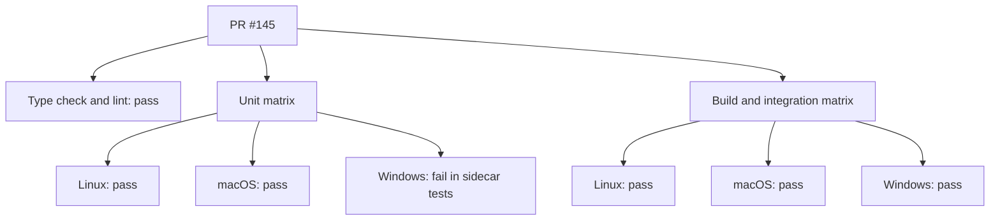
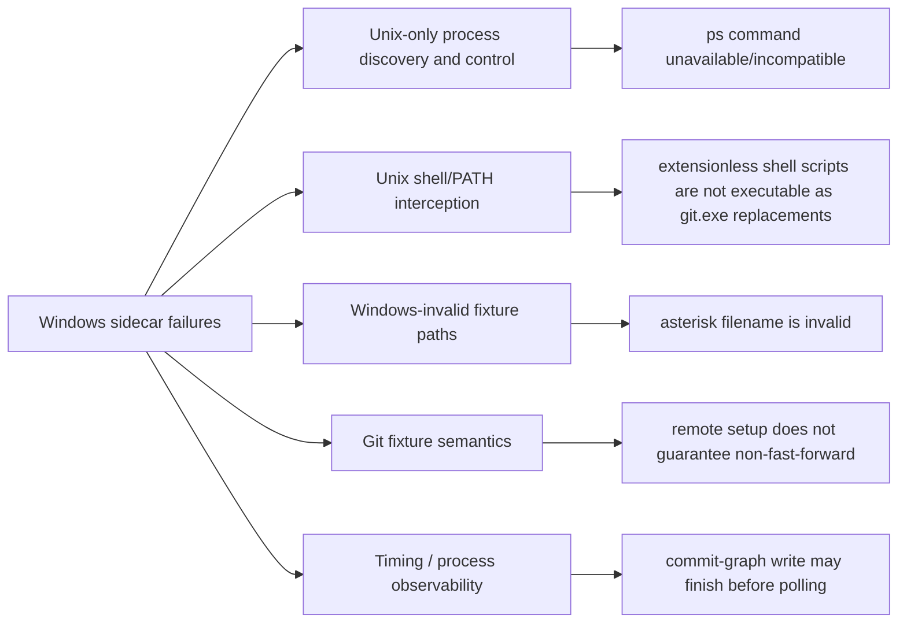

# Cross-platform CI and Windows sidecar failures

## Problem statement

PR [#145](https://github.com/ionalexandru99/rebase-git/pull/145) expands CI to Linux,
Windows, and macOS. The current GitHub Actions run passes every job except the Windows unit-test
matrix entry. This investigation determines which failures remain, whether the uncommitted local
changes address them, and what should be changed after review.

## Current status

| Item | State |
| --- | --- |
| Branch | `t3code/review-node-version-support` |
| Committed head | `3e233ad955c1340b72b4a60a7a8cc22b7618d103` |
| PR | `#145` — `ci: align Node support with Electron 41 runtime` |
| CI run | `30149052703` |
| Linux unit / integration | Passed |
| macOS unit / integration | Passed |
| Windows build / E2E / smoke | Passed |
| Windows renderer / main tests | Passed |
| Windows sidecar tests | Failed |
| Local worktree | Dirty with uncommitted test changes; preserved as user-owned work |

Implementation is complete locally. The PR still points at committed head `3e233ad`; GitHub Actions
cannot validate these fixes until the worktree changes are intentionally committed and pushed.

## CI shape



## Confirmed CI evidence

The failing Windows job is `89656168742` from workflow run `30149052703`. Its summary reports:

- 11 failed test files and 27 passed test files.
- 15 failed tests, 300 passed tests, and 12 skipped tests.
- The renderer and main-process test steps passed.
- The sidecar/integration step failed.

The failing test names are:

| File | Failing behavior |
| --- | --- |
| `literal-paths.integration.test.ts` | Literal-path amend fixture attempts to create `*.txt`, which Windows rejects |
| `amend.integration.test.ts` | Three PATH-wrapper sabotage/CAS scenarios do not intercept Git on Windows |
| `close-spares-mutation.integration.test.ts` | Uses Unix `ps -A -o command=` |
| `fetch-lock.integration.test.ts` | Uses Unix `ps -A -o command=` |
| `log-continuation-finalization.test.ts` | Fake repo path/process setup fails on Windows |
| `main-sidecar-stream-log.integration.test.ts` | Cannot observe the expected child before timeout |
| `open-repo.integration.test.ts` | Cannot observe an in-flight commit-graph process |
| `push-operations.integration.test.ts` | Non-fast-forward fixture unexpectedly pushes successfully |
| `server.test.ts` | Cannot observe/terminate the intended SimpleGit child before timeout |
| `spawn-finalization.test.ts` | Process-tree finalization assertions time out |
| `git/__tests__/instances.test.ts` | PATH fake Git is not used; real Git runs outside a repository |

## Failure families



## Working-tree changes already present

The local uncommitted edits touch 12 tracked sidecar test files and add
`src/sidecar/__tests__/ref-transaction-hook.ts`. They broadly attempt to:

- replace Unix `ps` scans and shell-based fake Git executables with PID files and Node helpers;
- create real hanging Git remotes through `remote.*.uploadpack`;
- make process-tree tests use cross-platform child spawning;
- replace PATH interception in amend tests with a `reference-transaction` hook;
- make commit-graph fixtures heavier so background work remains observable;
- repair push fixtures to create a genuine remote divergence;
- use real temporary repositories instead of hard-coded `/repo` paths.

The changes were reviewed against every failure in the Windows job log. Two remaining gaps were
identified and fixed after user approval.

## Timeline

| Time (Europe/Bucharest) | Investigation event |
| --- | --- |
| 2026-07-25 | Inspected branch state, CI workflow, and PR metadata |
| 2026-07-25 | Confirmed only the Windows unit matrix job fails |
| 2026-07-25 | Retrieved the full failing job log and grouped all sidecar failures |
| 2026-07-25 | Identified substantial uncommitted cross-platform test fixes in the worktree |
| 2026-07-25 | User approved the investigation and requested all confirmed issues be fixed |
| 2026-07-25 | Implemented the literal-path and Windows crash-tree fixes |
| 2026-07-25 | Passed the full sidecar suite and repeated timing-sensitive process tests |

## Files inspected

- `.github/workflows/ci.yml`
- `package.json`
- `vitest.sidecar.config.ts`
- `src/sidecar/__tests__/hanging-git.ts`
- `src/sidecar/__tests__/repo-fixtures.ts`
- all locally modified sidecar test files listed by `git status`
- GitHub Actions workflow run and Windows job logs

## Commands and external reads

```text
git status --short --branch
git remote -v
git branch --show-current
git rev-parse HEAD
git log --oneline --decorate -20
git diff --stat
git diff ...
rg --files ...
sed -n ... .github/workflows/ci.yml package.json vitest.sidecar.config.ts ...
GitHub: PR metadata, workflow run jobs, and Windows job log
```

## Confirmed findings

1. The workflow matrix and installation/build commands work on all three operating systems.
2. Windows E2E and smoke coverage already pass; the remaining blocker is entirely in sidecar tests.
3. Most failures are test-harness portability defects, not evidence of failing production behavior.
4. The local uncommitted changes target almost every failure family visible in the CI log.
5. The committed PR skips the main `*.txt` fixture group on Windows but does **not** skip or convert
   the separate amend fixture at line 446. The local edits also do not touch it, so this failure
   remains unfixed.
6. The rewritten unexpected-crash finalization test verifies that the direct Git child exits, but it
   no longer verifies the hanging upload-pack descendant. Its `afterEach` cleanup kills that
   descendant, which can hide a leak.
7. Production `TrackedChildren.kill()` calls `signalProcessGroup()`. On Windows that helper calls
   `child.kill()` and does not run `taskkill /t`, so the synchronous exit/crash path can leave Git
   descendants alive. Graceful asynchronous cancellation already uses `taskkill /t /f`.

## Local verification

| Check | Result |
| --- | --- |
| `pnpm check` | Passed — 314 files checked |
| `pnpm typecheck` | Passed |
| `pnpm test:sidecar` | Passed — 38 files, 327 tests, 16.54 seconds |
| Focused literal/fetch/finalization run | Passed — 3 files, 33 tests |
| Timing-sensitive process run 1 | Passed — 5 files, 36 tests |
| Timing-sensitive process run 2 | Passed — 5 files, 36 tests |
| `git diff --check` | Passed |

The first sandboxed sidecar attempt produced `spawnSync git EPERM`, which was an execution-sandbox
restriction rather than a repository failure. The suite was rerun with child-process permission and
passed. Vitest 3.0.5 does not support `--repeat`; repetition was performed with two additional
focused invocations instead.

## Final implementation

1. The amend literal-path test now uses `[abc].txt` and decoy `a.txt`. Both names are legal on
   Windows, and the assertion still proves Git does not expand the bracket glob.
2. The synchronous shutdown path now runs `taskkill /pid <pid> /t /f` on Windows. Graceful and crash
   shutdown therefore both terminate the full process tree.
3. The unexpected-crash test now waits for both the direct Git child and its upload-pack descendant
   to exit before cleanup.
4. The fetch cancellation test reuses the shared hanging-Git fixture instead of maintaining another
   Windows-sensitive implementation.
5. Shared hanging-Git cleanup uses bounded retries for delayed Windows file-handle release.

## Final changed-file summary

| File | Outcome |
| --- | --- |
| `src/sidecar/spawn.ts` | Synchronously terminates Windows child trees during unexpected shutdown |
| `src/sidecar/__tests__/literal-paths.integration.test.ts` | Makes amend literal-path coverage Windows-legal |
| `src/sidecar/__tests__/spawn-finalization.test.ts` | Uses real Git trees and verifies direct and descendant cleanup |
| `src/sidecar/__tests__/hanging-git.ts` | Provides reusable hanging remotes/Git processes and resilient cleanup |
| `src/sidecar/__tests__/fetch-lock.integration.test.ts` | Uses the shared hanging fixture and PID-based assertions |
| `src/sidecar/__tests__/close-spares-mutation.integration.test.ts` | Replaces Unix `ps`/`sleep` assumptions |
| `src/sidecar/__tests__/log-continuation-finalization.test.ts` | Uses a real repository and records the spawned Git PID |
| `src/sidecar/__tests__/main-sidecar-stream-log.integration.test.ts` | Uses a long real history and verifies abort termination |
| `src/sidecar/__tests__/open-repo.integration.test.ts` | Records background writes and uses a deterministic heavy fixture |
| `src/sidecar/__tests__/push-operations.integration.test.ts` | Creates a real non-fast-forward divergence |
| `src/sidecar/__tests__/repo-fixtures.ts` | Adds fast-import helpers for large deterministic histories |
| `src/sidecar/__tests__/server.test.ts` | Uses a hanging clean filter to test RPC cancellation portably |
| `src/sidecar/git/__tests__/instances.test.ts` | Uses a real hanging fetch for SimpleGit timeout coverage |
| `src/sidecar/__tests__/amend.integration.test.ts` | Replaces PATH wrappers with Git reference-transaction hooks |
| `src/sidecar/__tests__/ref-transaction-hook.ts` | Adds the cross-platform amend fault-injection helper |

## Remaining risks

- The new `reference-transaction` hook has only been executed locally on Linux. Its design uses the
  Git hook runner and Node rather than PATH interception, so it is structurally cross-platform, but
  GitHub Windows remains the decisive verification.
- The 500,000-commit commit-graph fixture and 50,000-commit stream fixture make timing observable
  without replacing Git. They passed repeatedly in about five and one seconds locally,
  respectively, but their Windows runtime should be checked against the 15-minute job timeout.
- The local `gh` authentication token is invalid. PR data and the failing Windows log were retrieved
  through the connected GitHub app, but the bundled CLI check script could not perform its own final
  status read.

## Discarded leads

- CI cache setup is not the blocker: dependency install and caching succeeded on Windows.
- Electron launch behavior is not the blocker: Windows E2E and smoke jobs passed.
- Node 24 selection is not the blocker: setup-node resolved Node `24.18.0` and all non-sidecar steps
  passed.

## Verification still needed

- A new GitHub Actions Windows run after these changes are committed and pushed.
- If CLI-based inspection is desired, refresh authentication with `gh auth login -h github.com`.

## Recommended next action

Review the final diff, then intentionally commit and push the complete cross-platform sidecar fix as
one coherent change. Watch the Windows unit job first; the other six GitHub Actions matrix jobs
already passed at the current PR head.
